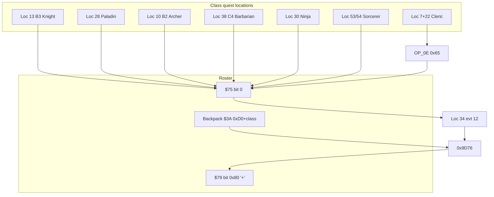

# Mount Farview / Juror class-quest events

Decode: `python tools/decode_event.py event.dat <loc>`  
Regenerate: `python tools/build_doc37.py` (merges this file + class-quest event decodes).  
Per-location events: [`EXTRACTED/docs/events/`](docs/events/README.md).  
ASM reward: **`0x9D76`** ([`36-class-quest-hp-bug.md`](36-class-quest-hp-bug.md))  
FAQ: section 4-11 (overview), 6-1..6-7 (per class), 9-1/9-2 (Sorcerer castles)

## Summary

| Role | event.dat loc | Map / sector | Completion tile (FAQ x,y) | Event | Turn-in |
|------|---------------|--------------|---------------------------|-------|---------|
| **Juror plaque + reward** | **34** | **D2** | **(7,0)** face N/S | **12** | `OP_0E` **`0x97`** -> **`0x9D76`** |
| Knight | 13 | B3 | (5,14) Jouster's Way | 08 | Farview |
| Paladin | 28 | Forbidden Forest Cvn | (8,8) | 03 | Farview |
| Archer | 10 | B2 | (2,11) | 17 | Farview |
| Barbarian | 38 | C4 | (15,0) | 12 | Farview |
| Cleric | 7 + 22 | C1 + Corak's Cave | ghosts (10,15); crypt (0,8) | 09 + 04/05 | `OP_0E` **`0x65`** then Farview |
| Ninja | 30 | Dawn's Mist Bog | (9,8) throne | 04 | Farview |
| Sorcerer | 53 + 54 | Ancients Good / Evil | puzzle doors + stasis | 04-06 | Farview |
| Robber | (none) | (none) | (none) | (none) | aid a class; Farview if eligible |

**Coordinates:** FAQ uses **(x,y)**. Engine triplet `pos = (y<<4)|x`, so FAQ **D2(7,0)** -> tile **(y=0,x=7)** -> **`0x07`**.

**Party rule (FAQ 4-11 / section 6):** Only the quest class plus **Robbers** (no other classes). Robbers earn **`'+'`** by **aiding** at least one class quest, then use the same Farview plaque.

**Quest-complete flag:** Completion scripts use `apply_party_masked(count=0, set=0x75, and=0xFE, or=0x01)` - bit **0** on roster byte **`$75`**.

**Farview ticket items (backpack slot `$3A`, engine `0x9D76`):** item id **`0xD0 + class_index`**: Knight `0xD0` ... Barbarian `0xD7` (see doc 36). Arena-colored tickets (Green/Yellow/Red/Black) are separate items.

**Class gate (`check_member_attr` field, value `0x05`):**

| Field | Class |
|-------|-------|
| `0x00` | Knight |
| `0x01` | Paladin |
| `0x02` | Archer |
| `0x03` | Cleric |
| `0x04` | Sorcerer |
| `0x05` | Robber (gates only; no solo completion tile) |
| `0x06` | Ninja |
| `0x07` | Barbarian |

---

## Quest guides

### Knight (FAQ 6-4)

| | |
|--|--|
| **Where** | **B3** - Jouster's Way, outdoor **(5,14)** (engine tile **(14,5)**, cond **`0x50`** facing) |
| **Prerequisites** | Knight (+ robbers only); pathfinder/mountaineer robbers help reach B3; magic herbs / ray guns for Dread Knight |
| **Steps** | 1. Enter Jouster's Way on B3. 2. Step on completion tile - event **08** checks Knight. 3. Win fight: **`EF`** Dread Knight + **`18`** mount. 4. Read victory text -> go **D2(7,0)** for reward. |
| **Completion** | loc **13**, event **08**, `apply_party_masked(0x75, FE, 01)` |
| **Farview** | Ticket **`0xD0`** in backpack slot 0; **`0x97`** -> 5M XP (intended) + **`'+'`** |
| **Monsters** | `EF 18` (Dread Knight + steed) |

### Paladin (FAQ 6-6)

| | |
|--|--|
| **Where** | **Forbidden Forest Cavern** (map **28**), **(8,8)** north-facing |
| **Prerequisites** | Paladin (+ robbers); temple bless vs Frost Dragon breath; high speed helps |
| **Steps** | 1. Reach cavern exit/arena. 2. Tile **(8,8)** - sign "Paladins Only!" on wrong class. 3. Fight monster **`0x94`** (Frost Dragon). 4. Return to Farview. |
| **Completion** | loc **28**, event **03** |
| **Farview** | Ticket **`0xD1`** |
| **Monsters** | `94` (Frost Dragon) |

### Archer (FAQ 6-1)

| | |
|--|--|
| **Where** | **B2**, **(2,11)** (engine **(11,2)**, cond **`0xA0`**) |
| **Prerequisites** | Archer (+ robbers); dispose of Wilfrey's allies first |
| **Steps** | 1. Falcon Forest on B2. 2. Event **17** - Wilfrey throws glove at archer. 3. Fight **`F0`** Baron Wilfrey. 4. Jurors at Farview. |
| **Completion** | loc **10**, event **17** |
| **Farview** | Ticket **`0xD2`** |
| **Monsters** | `F0` (Baron Wilfrey) |

### Barbarian (FAQ 6-2)

| | |
|--|--|
| **Where** | **C4** northwest **(15,0)** |
| **Prerequisites** | Barbarian (+ robbers); temple bless recommended |
| **Steps** | 1. Fly/walk to C4 NW corner. 2. Event **12** - Bruno challenge. 3. Fight **`ED`** Brutal Bruno + **`9B 9B`** guards. 4. Farview. |
| **Completion** | loc **38**, event **12** |
| **Farview** | Ticket **`0xD7`** |
| **Monsters** | `ED 9B 9B` |

### Cleric (FAQ 6-3) - hardest

| | |
|--|--|
| **Where** | **C1** ghosts **(10,15)**; **Corak's Cave** (map **22**) gates **(7-8,6)**, guide **(3,13)**, crypt **(0,8)** |
| **Prerequisites** | Admit 8 Pass (item **193**); **Holy Word** (C1 **(5,5)** face S); **Corak's Soul** (item **229** / `0xE5`); Holy Word for undead; robbers allowed at guide |
| **Steps** | 1. **Sandsobar (0,0)** or combat: Admit 8 Pass. 2. **C1 (5,5)** face south: Holy Word clue (loc 22 evt 06 popup references tree). 3. **C1 (10,15)**: fight ghosts (`AA`x8), receive **Corak's Soul** (loc **7** evt **09**). 4. Optional: max cleric spell levels at C1 guild. 5. **Corak's Cave**: present pass at **(7-8,6)** (evt **03**, consumes pass). 6. Holy Word past first undead **(7-8,5)**. 7. **(3,13)** with soul: guide opens Hero's Tomb (evt **04**, tile edits). 8. **S,E** to wall, **S,E** (FAQ **(13,3)**). 9. **(0,8)** crypt: guardian fight (`BA`x8), consume soul, **`exec_selector(0x65)`** reunion (not Farview plaque text). 10. **Surface** out; **D2(7,0)** for XP/`'+'`. |
| **Completion** | loc **22** evt **05** -> **`0x65`**; soul pickup loc **7** evt **09** |
| **Farview** | Ticket **`0xD3`** |
| **Items** | Admit 8 Pass `0xC1`/193; Corak's Soul `0xE5`/229 |

### Ninja (FAQ 6-5)

| | |
|--|--|
| **Where** | **Dawn's Mist Bog** (map **30**), **Dawn's Throne Room (9,8)** |
| **Prerequisites** | Ninja (+ robbers); skill potions to flee seductresses; teleport path via **D4(13,7)** 1W + teleport 9W |
| **Steps** | 1. Enter bog, throne room. 2. Event **04**: **`F9`** Dawn + **`AC AC`** seductresses. 3. Sets `$7B` bit `0x20` and `$75` quest bit on ninja win. 4. Farview. |
| **Completion** | loc **30**, event **04** |
| **Farview** | Ticket **`0xD5`** |
| **Monsters** | `F9 AC AC` |

### Sorcerer (FAQ 6-7, 9-1, 9-2)

| | |
|--|--|
| **Where** | Isle of Ancients - **Castle of Good** (loc **53**) and **Castle of Evil** (loc **54**); walk-on-water or teleport to island |
| **Prerequisites** | Sorcerer (+ robbers); **S3-4 Lightning Bolt** for 3x Iron Wizard (`6D`); FAQ door route **1-3-1-7-A-C-G-I** (Good) / mirror (Evil) |
| **Steps** | 1. Enter both castles (order arbitrary). 2. Solve numbered/lettered door riddles (clues on plaques). 3. Optional: Iron Wizards at **(4,1)** Good / **(11,14)** Evil. 4. Enter access codes: **Good** evt **04**=`**46**`, evt **05**=`**23**`; **Evil** evt **04**=`**64**`, evt **05**=`**32**` (FAQ: Ybmug left 23 right 46 / Yekop left 64...). 5. Free **Ybmug** (Good stasis **(10,3)**) and **Yekop** (Evil **(5,12)**) - each requires counterpart freed (`$75` bit flags). 6. Completion message -> Farview. |
| **Completion** | loc **53/54** evt **06**; `$75` OR masks `0x03` when both freed |
| **Farview** | Ticket **`0xD4`** |
| **Codes** | Good: **46**, **23**; Evil: **64**, **32** |

### Robber (FAQ 4-11 plaque)

| | |
|--|--|
| **Quest** | No `check_member_attr(fields=0x05)` completion tile |
| **Rule** | Travel with quest class only; must **aid** at least one class quest |
| **Reward** | Same **loc 34** evt **12**, **`0x97`** / **`0x9D76`** when eligible (ticket / flags) |

---

## Mount Farview Juror turn-in (location 34)

### Trigger

| Field | Value |
|-------|-------|
| Location | **34** (D2) |
| Tile | FAQ **(7,0)** -> engine **(0,7)** `pos=0x07` |
| Condition | **`0xA0`** (face N/S) |
| Event | **12** |

### Script (event 12)

```hex
03 0B 07 03 0C 07 0E 97
```

```
show_text(str[11])   # 5M XP, class test, '+'
wait_for_space()
show_text(str[12])   # solo + robber aid rule
wait_for_space()
exec_selector(0x97)  # -> category 0x44 -> engine 0x9D76
```

### Engine dispatch (`OP_0E` `0x97`)

1. **`0x160C2`** - no case `0x97` -> **`0x15EDC`**
2. Range **`0x97..0x98`** -> category **`0x44`**, index **1**
3. Thunk **`-$7DFA`** -> handler **`0x9D76`**

Related selectors: **`0x65`** Cleric reunion; **`0x86`/`0x87`** alternate XP paths ([`36-class-quest-hp-bug.md`](36-class-quest-hp-bug.md)).

---

## End-to-end flow



---

## Related locations

| Loc | Notes |
|-----|-------|
| **7** | C1 - Corak's Soul ghosts (evt **09**), Holy Word / Devil's Food (FAQ) |
| **61** | Meta string bank — [`loc_61`](events/loc_61_spell_hireling_index_tables.md) (HoS hints @ D2-7,0) |
| **38** evt **13** | C4 - Mega Dragon / Kalohn (era 800), not class quest |
| **47-48** | Castle doors - class signs, not turn-in |

---

## Regenerate

```bash
python tools/build_doc37.py
python tools/build_event_location_docs.py
python tools/decode_event.py event.dat 34
```

