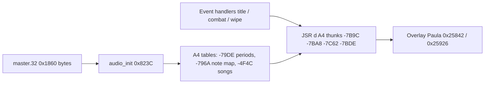

# MM2 music / SFX format (Paula tone synthesis)

## Summary

Might and Magic II does **not** play sampled music or `.wav` files for title, walk, or combat cues. Sound is **Amiga Paula tone synthesis** via `audio.device`, driven from:

1. A **6240-byte (`0x1860`) master blob** (resource name `master.32`, index **9** in the filename table at `0x0212..` / DATA `0x07B0`).
2. **Runtime tables** copied from that blob into the `A4` workspace during `audio_init` (`0x823C`).
3. **Sequencer routines** in CODE hunk 0 (and overlay helpers) that read song steps and call note/tone helpers through the `JSR d(A4)` thunk table (`A4 = $7FFE`).

### Verified thunk targets (this build)

Resolved directly from the A4 thunk table in `EXTRACTED/hunks/mm2_data_00.bin`:

- `JSR -$7C62(A4)` -> code `0x218EA`
- `JSR -$7C44(A4)` -> code `0x21D80`
- `JSR -$7BAE(A4)` -> code `0x22C24` (opcode dispatcher)
- `JSR -$7BA8(A4)` -> code `0x22D68`
- `JSR -$7B9C(A4)` -> code `0x22EAA`

Dispatcher (`0x22C24`) opcodes include direct jumps for:

- `0x04` -> `-$7BA8(A4)`
- `0x08` -> `-$7B9C(A4)`

The string `master.32` lives in the executable at code offset **`0x264`** (DATA pointer table index 9). On a full install the loader opens that file; the **logical format** is the `0x1860` byte stream read by `Read()` into RAM. The **player code** (init, Paula wrappers, thunks) is in the **CODE** hunk; **pitch tables and the 60×16-step song bank** are **not** usable until `audio_init` has parsed `master.32` into `A4-$79DE`, `A4-$796A`, and `A4-$4F4C`. A few **small tone-dispatch tables** (spell/combat message stingers) are embedded in CODE near **`0xF5BC`** / **`0x13C5E`**.

## Where playback is triggered (ASM call sites)

All paths below assume **`A4 = $7FFE`** and **`audio_init` has run** (also re-run from **`0x86D8`** when the music refresh timer fires). **`A4-$79B2`** is the **Sounds** flag (`1` = off): title music is skipped when Sounds is on @ `0x1000`.

| User-visible moment | Caller (CODE offset) | Audio entry | Indices / ids | Data used |
|---------------------|----------------------|-------------|---------------|-----------|
| **Main title** | `0x0FEE` / `0x1028` (menu setup); overlay `0x601C` | `JSR -$7B9C` **`play_song`** | Song **`0x12D`**, channel **`0x47`**, level **`0xE0`** | Blocking score; overlay driver **`0x22EAA`** + Paula |
| **Title ambience loop** | `0x1FF6`–`0x2014` (72 steps) | `JSR -$7BA8` **`song_step`** | Song **`0x12D`**, tempo **`0xE8`**, step `-$24(A5)` | Steps from **`A4-$4F4C`** (bank loaded from blob **`+0x780`**) |
| **Title UI chirp** | `0x1052` | `JSR -$7C62` **`play_note`** | Note **`0x11`** (17) | **`A4-$796A` → `A4-$79DE`** |
| **Combat enter** | `0x12C6E` … `0x12E42` (encounter setup) | `JSR -$7C62` + channel **`0x16`** | Note **`0x2B`** (43); voice alloc @ `0x12D42` | Same note map; optional **`play_tone`** if many monsters |
| **Combat round** | `0x12A22` | *(no fanfare)* | Sets **`A4-$79B2 = 2`**; channel **`0x0C`/`0x10`** @ `0x12A5A` | UI/collision only; stings come from message helper |
| **Monster turn sting** | `0x12848` via `0x12B3C` | `JSR -$7C62` / **`-$7BDE`** | Notes **17** or **32**, **29**, **31+slot**, **47**; HP-scaled tone | Periods from **`A4-$79DE`** after index lookup |
| **Combat victory** | `0x12430` when live monster count **0** @ `0x12C54` | `JSR -$7C62` × **23** | Note **`5`** (twice × `0x17` loops) | Victory jingle = repeated note **5** |
| **Party wipe / combat defeat** | `0x9F22` (all dead); `0x11660` (**`combat_defeat_retreat`**) | `JSR -$7E96` → **`0x7DCC`** | Voices **`0x31`/`0x32`/`0x33`** on ch **6–8**; **`play_tone`** on roster **gold / age / level** fields | Multi-voice funeral tones, not a single `play_note` index |

### Main title (`0x12D`)

1. **`0x1000`**: if **`A4-$79B2 != 1`**, after channel setup the game calls **`play_song`** with **`0x12D`** (`0x1014`–`0x1028`).
2. **`0x1FF6`**: non-blocking **`song_step`** loop — **`0x48`** iterations, same song id and tempo **`0xE8`** — drives the title from the **song bank** at **`A4-$4F4C`**, not a simple 0..59 index.
3. **`0x64F8`** (`play_song_scripted`): uses **`A4-$73C4`** as a **pointer table** (script lines + **`0x6798`** wait); song id **`0x12D`** is an **index into that table**, mainly for **text + blocking score** elsewhere (e.g. scripted scenes @ `0x78E6`), not the same as one row of the 60-song bank.

Overlay mirror: **`0x22FF6`** area (`0x601C`, `0x22FE6` **`0x12D`**, **`0x22FFC`** **`song_step`** via thunk **`-$7BA8`**).

### Combat start (`0x12C6E`)

Encounter setup clears combat BSS, saves/restores Sounds, builds the monster list, then:

- Allocates a **music channel `0x16`** (`0x12D9E`–`0x12DA2`, thunks **`-$7C74`** / **`-$7C56`**).
- If more than **10** monsters (`0x12E1E`), plays **`play_note` `0x2B`** then a **`play_tone`** whose duration argument is **`monster_count - 10`** (`0x12E42`–`0x12E58`).

Entering the **round loop** (`0x12A22`) only forces **`A4-$79B2 = 2`** and refreshes the combat display — **no victory/defeat melody** until **`0x13282`** returns and **`0x12C54`** / **`0x12C66`** branch.

### Combat end

- **Victory** — **`0x12430`**: after treasure/XP work, **`play_note` with index `5`** in two loops of **`0x17`** notes (`0x12508`–`0x12544`), plus palette/text helpers on channel **`0x26`**.
- **Defeat / retreat** — **`0x11646`**: **`JSR -$7E96`** (same thunk as party wipe) into **`0x7DCC`**, which prints **“Gather… / …has died!”** and assigns **three voice types `0x31`–`0x33`**, then **`play_tone`** on each survivor’s **`$66` (gold)**, **`$5C`**, or **`$25` (level)** depending on type.

### Party death (overworld / post-combat wipe)

When the party is eliminated outside the victory path (**`0x9F22`** after **`0x9F0A`** combat check):

- Same **`0x7DCC`** handler as defeat: **no `play_note` index** — **three programmable voices** + **HP/gold/age-scaled tones**.
- Earlier in the wipe sequence (**`0x9F6E`–`0x9FF0`**) XP is applied using **`A4-$796A`** note indices vs **`0x18`** threshold (game logic, not a sting).

### `play_note` / `play_tone` data path (all short SFX)

Typical **`play_note`** (`JSR -$7C62`, e.g. `0x205E8` spell path):

1. Stack: **note index** (e.g. victory **`5`**, walk **`0x2D`**, combat enter **`0x2B`**).
2. **`word = A4-$796A[index]`** (must be **< `0x18`** for audible slot).
3. **Period = `A4-$79DE[word]`** (and **`A4-$79CA`** for some dual-voice paths).
4. Channel **`0x20`** (`32`) for beeps, **`0x26`** (`38`) for longer music lines — via **`JSR -$7BFC`** then Paula.

**`play_tone`** (`JSR -$7BDE`): stack **duration**, **channel**, **period word** (often roster field or scaled HP).

Spell/combat **message** lines can bypass raw indices via the **CODE** jump table **`0xF5BC`** (8 words, e.g. **`$FF5C`…`$FFD0`**) before **`JSR -$7F3E`**.

The string `master.32` lives in the executable at code offset **`0x264`** (DATA pointer table index 9). On a full install the loader may still open a separate file with that name; the **logical format** is the `0x1860` byte stream read by `Read()` into RAM, not planar graphics.

## Loader flow (ASM)

| Step | Address | What happens |
|------|---------|----------------|
| Party/resource init | `0x3290` | `Read` **0x1860** bytes from `A4-$883A` into **`A4-$2A3E`** (per-character record buffer base; also used as load buffer here). |
| Audio init | `0x823C` | `Alloc` **0x1860** bytes; on failure call open helper (`-$843A`); `Read` blob into alloc buffer; parse into `A4` tables (below). |
| Reload | `0x86D8` | Same init when `A4-$7A48` timer exceeds `A4-$79EE` (re-parse). |

Blob parsing uses:

- **`0x815A`** — `memcpy` from blob base + cursor into a destination buffer.
- **`0x8192`** — read **big-endian u16** at cursor (packed offset in the stack argument), advance cursor.
- **`0x8176`** — bulk copy variant used for large blocks (song bank).

## Master blob → runtime layout (`audio_init` @ `0x823C`)

All destinations are **`A4` offsets** (true signed displacements from `$7FFE`). Init order:

| Blob read | Size | Runtime `A4` | Role |
|-----------|------|----------------|------|
| 10 × u16 | 20 | `-$79DE` | Pitch / period table **A** (10 words) |
| 10 × u16 | 20 | `-$79CA` | Pitch / period table **B** |
| 8 × u16 | 16 | `-$796A` | **Note index → table A** lookup (used by `play_note`) |
| u16 | 2 | `-$795A` | Voice/channel count cap (`cmp` in voice alloc) |
| u16 | 2 | `-$79B6` | Related timing / era hook |
| u16 | 2 | `-$79B4` | Related timing |
| u16 | 2 | `-$7972` | Global transpose / music flag |
| u16 | 2 | `-$7970` | Global transpose / music flag |
| u16 | 2 | `-$796E` | Global transpose / music flag |
| offset **`0x780`** | **1920** | `-$4F4C` | **Song bank**: **60** songs × **16** steps × **2** bytes (u16 per step) |
| 10 bytes | 10 | `-$7995` | Small byte table |
| 24 bytes | 24 | `-$798B` | Per-key / walk-related byte flags |
| 4 bytes | 4 | `-$79A4` | Small word table |
| 1 byte | 1 | `-$79B2` | **Sounds on** (title skips music when `== 1`) |
| 1 byte each | … | `-$79B0`..`-$7996` | Walk SFX / UI flags |

Song stride: `song_index * 0x20 + step * 2` → u16 at `A4-$4F4C` (`asl #5` on song index in init and playback).

## Song step playback (`0x2188` region)

`play_song_step` logic (overlay/title path uses `JSR -$7BA8`):

1. Form index: `(screen_mode << 5) + (coord_nibble << 1)` into song bank.
2. Load step word; **mask** with `A4-$75EE` (coord-dependent enable table).
3. If zero, rest.
4. Else decode low byte: `(byte >> 2)` indexes **`A4-$762E`**; OR in channel/mode bits from screen id (`0x29`..`0x2C`).

## Title music

- **Gate:** `A4-$79B2` (Sounds) `cmpi #1` — if Sounds on, title tune is skipped (`0x1000`).
- **Blocking score:** `JSR -$7B9C` (`play_song`) with args including song id **`0x12D`** (`0x1000`..`0x1028`).
- **Overlay step loop:** `0x1FF6`..`0x2014` — **72** (`0x48`) calls to `JSR -$7BA8` with song **`0x12D`**, step counter, tempo **`0xE8`**.

`0x12D` is a **script / score id** (also used with pointer table `A4-$73C4` @ `0x64F8`), not a simple 0..59 index into the 60-song bank.

## Short SFX (`play_note` family)

- **`JSR -$7C62`** — play note by **index** (stack: note number, e.g. walk **`0x2D`**, victory **`5`**, death **`17/29/31`**).
- Index maps through **`A4-$796A`** into period table **`A4-$79DE`**.
- **`JSR -$7BDE`** — play tone with duration + period word (scaled on monster death @ `0x12848`).
- Channel **`0x26`** (`38`) music; **`0x20`** (`32`) short beeps.

## Paula / `audio.device`

Vectors cached at **`A4-$48C`** / **`A4-$490`**; wrappers at `0x25842` / `0x25926` forward to `audio.device` (start/stop/set period/volume).

## Tone helper table (code)

Jump-offset table at **`0x13C5E`** / **`0xF5BC`** (8 entries, words like `$FF5C`, `$FF6E`, …) — **dispatch table for spell/combat message tones**, not raw periods.

## Extracting the blob from the executable

The **code** hunk contains all drivers; the **0x1860 master blob** is loaded at runtime via the same path as `master.32`. A static scan of `EXTRACTED/mm2` hunks (CODE+DATA+overlay) does not expose an obvious contiguous 6240-byte instance on this copy (no `master.32` on `MM2BOOT` either). Tools should:

1. Accept `--master path` for a captured **`0x1860`** file.
2. Optionally scan a raw binary for a candidate (heuristic in `tools/mm2_music.py`).

## C struct

See `EXTRACTED/decomp/mm2_music.h` and `tools/mm2_music.py` (`MasterMusic` dataclass).

## Per-event path dumps (JSON)

The current build has a repeatable per-event call-path exporter:

- Script: `tools/export_mm2_event_audio_paths.py`
- Inputs: `EXTRACTED/mm2.capstone.asm`, `EXTRACTED/tmp_mm2_thunk_map.txt`
- Outputs:
  - `EXTRACTED/mm2_event_audio_paths.json` (all events in one bundle)
  - `EXTRACTED/audio-events/title.json`
  - `EXTRACTED/audio-events/combat_enter.json`
  - `EXTRACTED/audio-events/combat_victory.json`
  - `EXTRACTED/audio-events/party_death_or_defeat.json`

Each event JSON includes:

- callsite address
- thunk slot (`JSR -$xxxx(A4)`)
- resolved target function (from thunk map)
- nearby stack push context (immediates/register pushes into the call)
- normalized `literal_stack_args` where immediate words and `CLR.W` pushes are decoded to integers

## Related docs

- `EXTRACTED/docs/06-gfx-loading.md` — filename table (`master.32` index 9)
- `EXTRACTED/docs/14-game-state-struct.md` — `A4` workspace / thunks
- `EXTRACTED/docs/01-startup-init.md` — `A4 = $7FFE`
