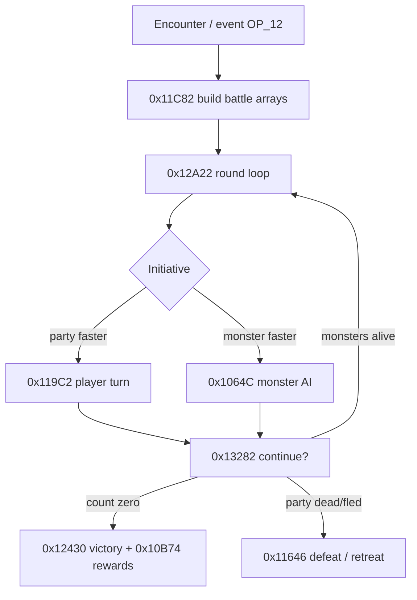

# Combat (overview)

Might & Magic II combat is a **turn-based round loop** with up to **11 monster slots**
and parallel party character objects. This page is the hub; the full 68k trace lives
in [Combat System](17-combat-system.md).

## Flow at a glance

## Data you need

| Topic | Doc |
|-------|-----|
| Round loop, commands, AI, rewards | [Combat System](17-combat-system.md) |
| `monsters.dat` bytes 0x10–0x13 (attacks, flee, multiply) | [monsters.dat Format](16-monster-ability-format.md) |
| Spell bytes, combat-only flags | [Spells and Item Use](19-spells-and-item-use.md) |
| Item **use** byte → spell handler `0x133EC` | [items.dat Format](18-items-dat-format.md) |
| Encounter setup from maps | [Event Script Opcodes](07-event-script-opcodes.md) (`OP_12` / `OP_13`) |
| Encounter sprites in viewport | [3D View and Game Screen](15-3d-view-and-game-screen.md) (`0x316E`) |
| Animated `.anm` | [Monster Sprites](Monster-Sprites) · [World Sprites](World-Sprites) (king `56`, queen `41`) |

## Player commands (combat)

From `0x11866` / `0x1175C` — bar strings at `A4-$6F9C`:

| Key | Action |
|-----|--------|
| A | Attack (single target) |
| F | Fight (auto melee) |
| S | Shoot (ranged / bow) |
| C | Cast spell → jump table `0xD000` |
| U | Use item → `0x133EC` |
| B | Block |
| R | Run / retreat |
| E | Exchange |
| V | View character |

Capability flags (`-$5E36` melee, `-$5E35` shoot, `-$5E34` cast) depend on rank,
class, silence, and SP.

## Monster behaviour (summary)

Unpack each slot with **`0x4C8E`** from `monsters.dat`, then AI at **`0x106A0`**:

- **Flee** — Oabil bits 5–6 → `0x10DFC`
- **Group verb** — Pabil low 5 → table `A4-$6E56` @ `0x10002` (e.g. “frenzies”)
- **Single-target status** — Sabil low 5 → victim table @ `0xFEEA`
- **Multiply** — Oabil bit 7 → `0x100B0`
- **Adds friends** — Oabil low nibble → `0x11F0A`

## Gallery & catalogs

- [Monsters](Monsters) — all named `monsters.dat` rows + sprite thumb
- [Monster Sprites](Monster-Sprites) — every combat `.anm` referenced by picture byte
- [Items Catalog](Items-Catalog) — use-power / combat item spells

## Still open

See [Combat System](17-combat-system.md) § Open items — to-hit math, HP/XP tables, per-spell handlers.
