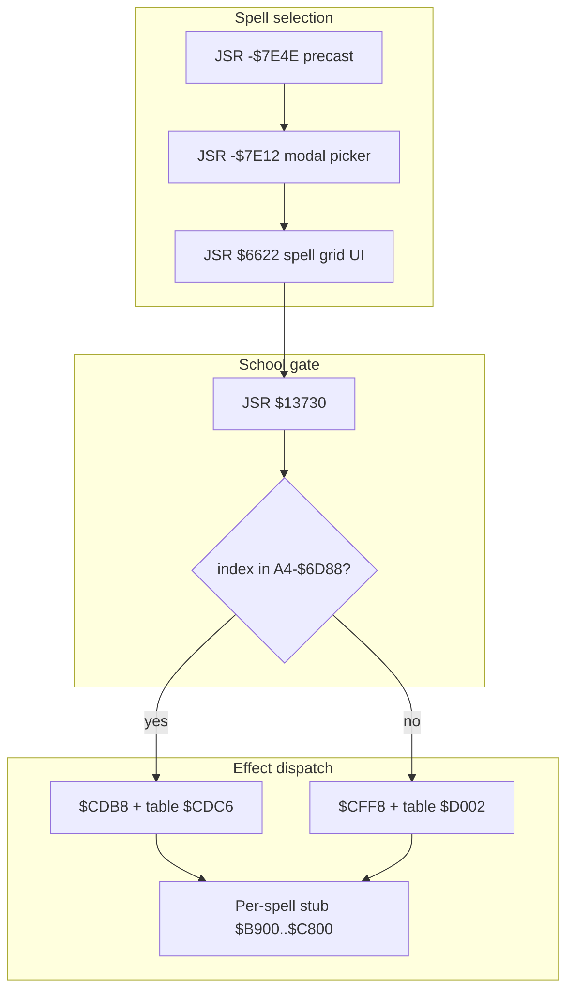

# Spell casting — ASM trace

Traced from `EXTRACTED/mm2.asm` (IRA + DC-gap decode) and cross-checked with
`tools/_map_spell_handlers.py` / `tools/_trace_spell_picker.py`.

Addresses are **code-hunk load addresses** (Capstone base 0). `A4` is set to
`LAB_7FFE` at init (`0x24948`); game fields use negative `d(A4)` displacements.

## Overview



## Combat cast path

Combat **does not** draw the spell-book grid. `C` goes straight to the level/number
prompt (`-$7E12` / `0x79EE`). The grid (`LAB_6622`) is only used from exploration
cast (`0x6E30`) and from combat character-sheet **`V`** (`0x675A`).

| Step | Address | IRA / gap line | Role |
|------|---------|----------------|------|
| Player turn | `0x119C2` | ~13501 (DC) | Combat menu loop |
| Command bar | `0x11866` | ~13479 | Sets `A4-$5E34` if caster, not silenced, SP>0 |
| Read key | `0x1175C` | ~13463 | `CMPI #$43` accepts **C** |
| Dispatch | `0x11BF8` | ~13538 | `'C'` (`#$43`) → `0x11A90` |
| Precast | `0x11A90` | ~13515 | `JSR -$7E4E(A4)` |
| Picker | `0x11AAC` | ~13517 | `JSR -$7E12(A4)` → index in **D0**, `$FFFF` = cancel |
| School gate | `0x11AE8` | — | `JSR $13730(PC)` with index on stack |
| Cleric FX | `0x11AF6` | — | if gate **≠ 0**: `JSR $CDB8(PC)` |
| Sorc FX | `0x11B02` | — | if gate **= 0**: `JSR $CFF8(PC)` |
| SP spend | `0x11B14` | — | optional `JSR $6DEE` / refresh |

## Exploration / non-combat cast (`0x6E30`)

Readable IRA (not DC gap) — same picker, always uses **`$CDB8`** after selection:

```9530:9565:EXTRACTED/mm2.asm
	LINK.W	A5,#-6			;06e30
	...
	JSR	LAB_6622(PC)		;06e8a   ; spell grid
	JSR	-32274(A4)		;06e9a   ; -$7E12 picker
	...
	JSR	LAB_CDB8(PC)		;06ebc   ; effect dispatch
```

## `JSR -$7E12(A4)` — spell picker

- **Call sites:** only `0x06E9A` and `0x11AAC`.
- **Not** present as normal `LAB_` code in the static image at `A4-$7E12` (that
  resolves to `0x01EC`, which is embedded string data in the hunk header).
- Behaves like other MM2 UI entry points (`-$7BD2`, `-$7BE4`, …): a **runtime
  thunk** in the `A4` workspace that opens the Intuition/list UI.
- Nearby helper **`0x6622`** builds the spell list grid before/around the modal:
  - Reads `A4-$85B0` (active caster context).
  - Uses **`A4-$8C22`** (9 level labels) and **`A4-$8C2B`** (spells-per-level counts).
  - Walks known spells via **`LAB_65C2`** / character field **`$51(A0)`** (spellbook
    bitmask on the live character object, sourced from roster `$4C..$57` at load).
- **`0x67C0`** (called from spell UI setup @ `0x65B8`) uses **`JSR -$7BD2(A4)`**
  (same key-validation family as combat `0x1175C`) to step the highlight and
  return the chosen index.

## `JSR $13730` — school gate (`spell_school_gate`)

```text
013730  link.w  a5,#$fffc
        ...
013744  lea.l   -$6d88(a4),a0    ; 13 x uint16 table
013748  cmp.w   (a0,d0.l), 8(a5) ; spell index from picker
        ...
        ; loop i = 0 .. 11
013766  addq.w  #1,-$2(a5)      ; if match before end → return 1
01376a  move.w  -$2(a5),d0      ; else return 0
        rts
```

| Return | Combat branch | Meaning |
|--------|---------------|---------|
| **1** | `JSR $CDB8` | Picked index appears in **`A4-$6D88`** (13 words) → **cleric** jump table |
| **0** | `JSR $CFF8` | No match → **sorcerer** jump table |

The table at `A4-$6D88` is only **read** here (no static initializer found in
`mm2.asm`); it is filled at runtime when the caster/context is set up.

## Effect dispatchers

Dispatch is **two-stage**:

1. A sparse-code executor validates/normalizes `D0` and jumps by offset table.
2. The jump lands on a `jsr <stub> ; bra <return>` pair.

### `$CDB8` path (selected when `$13730 != 0`)

```text
00cdb8  link.w  a5,#0
00cdbc  move.w  8(a5),d0
00cdc2  bra.w   $cfde
...
00cfde  cmp.l   #$60,d0        ; codes 0..95
00cfe8  lea.l   $cf1e(pc),a0   ; sparse offset table
00cfec  move.w  (a0,d0.w),d0
00cff0  jmp     $cff2(pc,d0.w)
```

- Stub pairs begin at **`0xCDC6`**.
- There are **43 direct spell stubs** in this block (`0xCDC6..0xCF1A`).
- Offset table at **`0xCF1E`** is sparse; sentinel value `+2` maps to return/no-op.

### `$CFF8` path (selected when `$13730 == 0`)

```text
00cff8  link.w  a5,#0
00cffc  move.w  8(a5),d0
00d002  bra.w   $d266
...
00d266  subq.l  #2,d0
00d268  cmp.l   #$5c,d0        ; post-adjust range
00d272  lea.l   $d1ae(pc),a0   ; sparse offset table
00d276  move.w  (a0,d0.w),d0
00d27a  jmp     $d27c(pc,d0.w)
```

- Primary spell stub pairs at **`0xD006..0xD182`** (48 Sorcerer entries).
- Additional handlers at **`0xD186..0xD1AA`** (5 extra entries) are reached via
  sparse table codes (these are part of the shared skill/spell engine, not a
  separate top-level cast menu).
- Offset table at **`0xD1AE`** is sparse; `+2` entries again mean return/no-op.

### Why this matters

- The picker/gate does **not** pass a dense 0..47 school-local index directly.
- It passes a **sparse spell code** consumed by the executors above.
- `A4-$6D88` in `$13730` acts as a 13-entry membership/gate list over that code
  space (currently read-only in static analysis).

### Shared exit

Spell/skill handlers live in **`0xB900`–`0xC800`**; common return points are
`$CFF4` (CDB8 path) and `$D27E` (CFF8 path).

## Sample stub: S1/1 Awaken (`0xB66C`)

Typical combat spell stub pattern:

```text
00b66c  link.w  a5,#$fffe
00b670  jsr     $d464(pc)      ; target picker ("which monster?")
00b678  cmpi.b  #$1b,-$1(a5)   ; cancel target?
00b680  ...
00b688  jsr     $133b6(pc)      ; apply effect (level, count, target)
00b69c  jsr     $108bc(pc)      ; combat resolver / messaging
00b6a2  move.b  #1,-$7958(a4)  ; spell-acted flag
```

| Helper | Address | Role |
|--------|---------|------|
| `$D464` | `0xD464` | Target selection UI; sets `A4-$7958`; `'A'..'J'` monster slots |
| `$133B6` | `0x133B6` | Effect applier: uses caster level `$71(A0)`, RNG `-7BB4`, loops targets |
| `$108BC` | `0x108BC` | Combat-side apply (monster count `-77BE`, party `-524`) |
| `$6DEE` | `0x06DEE` | Deduct SP/gems from caster at `A4-$B834` after cast |

## `spells.dat` usage

- On-disk: **96 × 2 bytes** cost/type (see `19-spells-and-item-use.md`).
- **`0xE260`** and **`0x13772`** are equivalent spell-info render helpers:
  - both index **`A4-$702A`** (`lea -$702A(a4); move.l (a0,d0*4),...`),
  - print labels via `-$7B84` / `-$7BE4`,
  - optionally print suffix at `A4-$7026`,
  - end with `jsr -$7E84(a4)` (UI/audio cue path).
  This is strong evidence that `A4-$702A/$7026` are spell metadata text pointers
  (cost/type fragments) loaded before cast UI.
- Stub handlers use **`$133B6` / `$108BC`** for behaviour; they do not read
  `spells.dat` directly in the stub prologue.

## IRA gap navigation

Combat/spell code from **`0x8000`–`0x248A5`** is stored as `DC.L` in `mm2.asm`.
To read it:

1. Generate `mm2.capstone.asm`: `python tools/disasm_m68k.py <mm2 executable> -o EXTRACTED`
2. Or run: `python tools/_map_spell_handlers.py` / `tools/_trace_spell_picker.py`

## Tools

| Script | Purpose |
|--------|---------|
| `tools/_map_spell_handlers.py` | Full Sorc/Cleric jump table ↔ spell names |
| `tools/_trace_spell_picker.py` | Disassemble picker, gate, stubs |
| `tools/_trace_spell_cast.py` | Earlier combat-path trace |
| `tools/label_capstone.py` | Known labels @ combat addresses |

## Open items

- Static body of **`-$7E12`** (picker thunk) — needs runtime/workspace dump or second code hunk.
- Exact producer of **`A4-$6D88`** (13-word sparse-code membership table).
- Per-stub semantics (damage formulas, status opcodes) in **`0xB900`–`0xC800`**.
- Confirm **`A4-$702A`** ↔ `spells.dat` load buffer with a loader trace @ `0x29868` filename ref.
