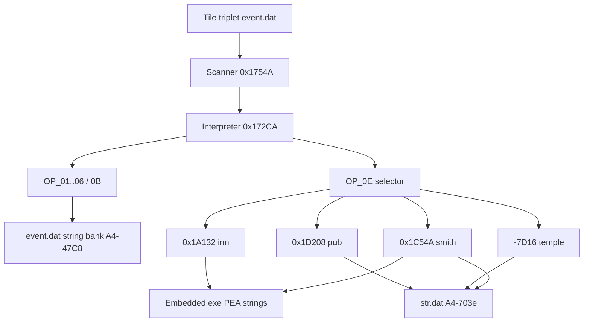

# Event scripts → on-screen text (MM2 Amiga)

How **`event.dat`** dialogue reaches the player, and how **`OP_0E`** town services
pull text from **`str.dat`** or the **executable** instead. ASM references:
[`mm2.capstone.asm`](../mm2.capstone.asm) (handlers below), [`07-event-script-opcodes.md`](07-event-script-opcodes.md),
[`29-embedded-exe-strings.md`](29-embedded-exe-strings.md), [`28-town-services.md`](28-town-services.md).

---

## Short answer (plain language)

**Mixed model.** Tile scripts in **`event.dat`** only pass **small numeric indices**
(string index, `OP_0E` selector byte, gold amount, etc.). They **do not** open
`str.dat` directly.

- **`OP_01`–`OP_06`** resolve text from the **current location’s `event.dat`
  string bank** (copied into workspace `A4-$47C8`, indexed via `A4-$86AC` /
  `A4-$5D3C`).
- **`OP_0B`** does **not** display text at all (neither `event.dat` nor
  `str.dat`). It loads a **signboard `.anm` sprite**: `0x15756` maps the opcode's
  first byte through a per-environment sign table to a sign id (`NN.anm`). The
  decoders treat its arg0 as a **sign index**, not a string index — see §2.2 and
  [`45-event-graphics-opcodes.md`](45-event-graphics-opcodes.md).
- **`OP_0E`** passes one **selector byte** into a **C-like service handler**
  (pub, inn, temple, training, guild, smith, …). That handler loads UI strings
  from **`str.dat`** (`A4-$703e` base, drawn with `-$7BE4`) and/or **embedded
  ASCII in the code hunk** (`PEA` PC-relative addresses; see doc 29).
- **Numeric shop data** (donation gold, spell bytes, rolled stock) comes from
  **data-hunk master tables** and/or **RNG** at shop-open, not from `event.dat`.

**Pub vs inn:** Food, drinks, and specialties are **`OP_0E` `0x03` → `0x1D208`**
(tavern). The inn is **`0x01` → `0x1A132`** (rest, registry, hirelings) and uses
mostly **exe-embedded** prompts (`0x19D00`…, doc 29).

---

## 1. Interpreter entry (`0x172CA`)

| Step | Address | Role |
|------|---------|------|
| Tile scan | `0x1754A` | `(y,x)` triplets → event id → script PC in location record |
| Dispatch loop | `0x1750C` | Fetch opcode byte |
| Opcode table | `0x17494` | Jump table for `0x00`…`0x32` |
| Invalid | `0x1748C` | Sets abort `A4-$8616` |

`OP_0E` stub: `0x1734E` → `jsr 0x160C2` → return to `0x1750C`.

---

## 2. Event-local text (`OP_01`–`OP_06`) + the `OP_0B` sign sprite

### 2.1 Index → string bytes

| Step | Address | What |
|------|---------|------|
| Read `u8` index | `0x155BE` | Next script byte |
| Resolve string | `0x15884` | Walk `0xFF`-terminated strings in `A4-$47C8`; save cursor in `A4-$5D44` |
| Copy for draw | `0x158C8` | Copy into `A4-$5D3C`; `@` (`0x40`) → newline `0x0A` |

Loader (`0x92F2` / scanner `0x1754A`) sets **`A4-$86AC`** to the location’s
string base inside the decoded event work buffer. **No `str.dat` read** on this path.

### 2.2 Per-opcode display

Full pixel-exact draw paths (thunk targets, dest rects, line metrics, prompt
loops, restore behavior) are traced in
[`44-event-text-rendering.md`](44-event-text-rendering.md).

| Op | Handler | Text source | Draw path (thunk → routine) | Dest |
|----|---------|-------------|------------------------------|------|
| `01` | `0x15924` | event.dat | `-$7EC0` → `0x54F2` | centered, **row 17** (cols 1..38 cleared) + row-18 divider |
| `02` | `0x15942` | event.dat | `-$7F62`→`0x42DC` clear, `-$7BFC`→`0x22108` cursor, `-$7C62`→`0x218EA` putchar | block **rows 19..22**, col 1 |
| `03` | `0x159CE` | event.dat (via `02`) | `-$7F5C`→`0x43A8` + `-$7ED8(2)`→`0x5312` prep, then `02` base 17 | block **rows 17..22**, col 1 |
| `04` | `0x159F4` | event.dat | `-$7BE4` → `0x22376` (JAM1) | door label, **row 3**, centered on col 14, over 3D view |
| `05` | `0x15A46` | event.dat | `-$7C74`→`0x21624` window + `-$7BE4` | popup cells **(4,3)-(24,13)**, centered, transparent |
| `06` | `0x15AEE` | event.dat | glyph signpost + post, pen `$7A50` | outdoor sign **(7,7)-(19,14)** |
| `0B` | `0x15DB0` | **sign `.anm`** (no text; `0x15756` maps arg0→sign id) | `-$7FC2`→`0x316E` sprite + `-$7FBC`→`0x3266` place | **service** signboard sprite over viewport |

**`OP_09` / `OP_0A`:** y/n prompts (`0x15D3C`, Y → cond `A4-$7951`); question
text still comes from prior **event** opcodes, not `str.dat`. **`OP_07`/`08`**
SPACE-wait (`0x15CE6`) prints `"('Space' to continue)"` at (9,23) then redraws
the row-23 rule (`-$7F4A` → `0x44E0`). See doc 44 §3.7.

---

## 3. `OP_0E` selector dispatch (`0x160C2`)

Reads one **`u8` selector** (`0x160C0` / `0x155BE`), then chained subtract /
range bins (see [`07-event-script-opcodes.md`](07-event-script-opcodes.md)).

### 3.1 Named selectors (town services)

| Sel | Decoder name | Call | Notes |
|-----|--------------|------|-------|
| `0x01` | `open_inn_lodging` | `0x1A132` | Inn rest / dismiss; exe + str |
| `0x02` | `open_training` | `-$7CD4` | Training hall; level-up from XP |
| `0x03` | `open_tavern_food` | `0x1D208` | Pub menu; **`A4-$79F2`** town index |
| `0x04` | `open_temple` | `-$7D16` | Temple; `str.dat` + spell/donation tables |
| `0x05` | `open_mages_guild` | `-$7D10` | Guild spells; membership check `0x1E410` |
| `0x06` | `open_blacksmith_shop` | `0x1C54A` | Smith; static + RNG stock tables |
| `0x07`–`0x08` | store / arena | `-$7DB8` / `-$7DBE` | General store / Arena Games (`0x9D76`) |
| `0x0A` | goblet quest | `-$7DAC` → `0xD634` | **Nordon** `(10,2)/W` event 30 — loc 60 str[9] |
| `0x0E` | default-range | `-$7DFA` → loader | **Feldecarb Fountain** `(15,15)` event 17 — loc 60 str[23] (see doc 53) |
| `0x0D` | `enroll_mages_guild` | `-$7DA0` | Sets roster `$0B` home town (not purchase gate) |

Default path (`0x15EDC` → `-$7DFA`): selector binned to category `0x3C`–`0x46`;
**temporarily overwrites** `A4-$79F2` with category byte for the call.

### 3.2 What `OP_0E` does *not* do

- Does **not** read `event.dat` strings for shop menus.
- Does **not** embed item names in the script; handlers use **`str.dat`** and/or
  **rolled pointers** built at shop-open.

---

## 4. Service handlers → text sources

Global UI base: **`A4-$703e`** = loaded **`str.dat`** (see `0x7DF6`, `0x807A`,
`0xE63C`: `move.l -$703e(a4), -(a7)` before `-$7BE4` text draw).

| Handler | Selector | Primary strings | Secondary |
|---------|----------|-----------------|-----------|
| Inn `0x1A132` | `0x01` | **Embedded exe** (`0x19D00`…, doc 29) | Shared gold messages in str |
| Training `-$7CD4` | `0x02` | **`str.dat`** + **exe** training prompts | HP path messages @ `0x9BCA` |
| Pub `0x1D208` | `0x03` | **`str.dat`** menus (food A–C, drinks A–F, rumors) | Pub NPC intros in str; rumor bytecode `A4-$119A` |
| Temple `-$7D16` | `0x04` | **`str.dat`** priest lines + spell menu | Donation UI; spell names via spell index → str |
| Guild `-$7D10` | `0x05` | **`str.dat`** + membership error (str ~369) | Spell list pointers `A4-$6AB4` |
| Smith `0x1C54A` | `0x06` | **`str.dat`** smith intros (defer path) + category lines | Category lines from `A4-$5AA6`; specials from RNG `A4-$5A56` |

**Remake note (doc 28 §1.4.3):** pub/temple show str.dat y/n intros before the
menu; blacksmith opens the buy menu directly when `PlayTownServiceUi` is bound.

### 4.1 Pub food (`0x1D208`) — not the inn

- Town index: **`A4-$79F2`** (map screen 0–4).
- Menu strings: **`str.dat`** block (~lines 109–127 in [`11-str-decoded.txt`](11-str-decoded.txt)).
- Food/drink **effects** use engine item/food helpers (`-$7F68` modes `0x33`, etc.);
  **item ids** come from handler tables / scripts, not from `event.dat` text indices.

### 4.2 Temple spell purchase (`0x1D992` area)

- Spell **indices** per town: `A4-$66E2` / `A4-$66CE` (runtime bytes).
- Display: index → spell name in **`str.dat`** (`-$7E90` / `-$7E8A` helpers).
- Temple open (`0x1D208`) fills pointer tables via **`-$7DE2` RNG** (same family as smith).

### 4.3 Embedded exe (doc 29)

Innkeeper dialogue, some shop chrome, training lines, chests/traps: **`PEA` PC**
in code hunk 0. **`str.dat` codec does not apply.** Cross-ref category table in
[`29-embedded-exe-strings.md`](29-embedded-exe-strings.md).

---

## 5. Flow diagram

---

## 6. Related tooling

| Tool | Purpose |
|------|---------|
| `tools/decode_event.py` | Opcodes + `OP_0E` selector names |
| `tools/mm2_codec.py str-decode` | `str.dat` → `11-str-decoded.txt` |
| `tools/dump_shop_tables.py` | Data-hunk **master** numeric tables (not runtime BSS) |
| `editor/src/core/EventOps.h` | Opcode mirror |

**Note:** `tools/extract_embedded_strings.py` is referenced in doc 29 but may
need to be re-added to the repo; use doc 29 + capstone PEA xrefs meanwhile.

---

## 7. Completeness (this doc)

| Topic | Status |
|-------|--------|
| Event opcode → event.dat strings | **Complete** (ASM `0x15884` / `0x155BE`) |
| `OP_0E` → handlers | **Complete** (`0x160C2`) |
| Handlers → str.dat / exe | **Complete** (handler survey) |
| Remake town-service UI | **Partial** — see [`28-town-services.md`](28-town-services.md) §1.4.3 |
| Per-town numeric item/spell tables | See [`28-town-services.md`](28-town-services.md) §13 + `EXTRACTED/shop_tables.json` |
