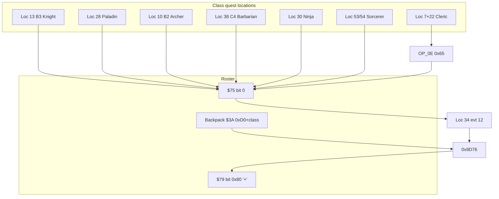

# Mount Farview / Juror class-quest events

Decode: `python tools/decode_event.py event.dat <loc>`  
Regenerate: `python tools/build_doc37.py` (merges this file + class-quest event decodes).  
Per-location events: [`EXTRACTED/docs/events/`](docs/events/README.md).  
ASM reward: **`0x9D76`** ([`36-class-quest-hp-bug.md`](36-class-quest-hp-bug.md))  
FAQ: section 4-11 (overview), 6-1..6-7 (per class), 9-1/9-2 (Sorcerer castles)

## Summary

| Role | event.dat loc | Map / sector | Completion tile (FAQ x,y) | Event | Turn-in |
|------|---------------|--------------|---------------------------|-------|---------|
| **Juror plaque + reward** | **34** | **D2** | **(7,0)** face N/S | **12** | `OP_0E` **`0x97`** -> **`0x9D76`** |
| Knight | 13 | B3 | (5,14) Jouster's Way | 08 | Farview |
| Paladin | 28 | Forbidden Forest Cvn | (8,8) | 03 | Farview |
| Archer | 10 | B2 | (2,11) | 17 | Farview |
| Barbarian | 38 | C4 | (15,0) | 12 | Farview |
| Cleric | 7 + 22 | C1 + Corak's Cave | ghosts (10,15); crypt (0,8) | 09 + 04/05 | `OP_0E` **`0x65`** then Farview |
| Ninja | 30 | Dawn's Mist Bog | (9,8) throne | 04 | Farview |
| Sorcerer | 53 + 54 | Ancients Good / Evil | puzzle doors + stasis | 04-06 | Farview |
| Robber | (none) | (none) | (none) | (none) | aid a class; Farview if eligible |

**Coordinates:** FAQ uses **(x,y)**. Engine triplet `pos = (y<<4)|x`, so FAQ **D2(7,0)** -> tile **(y=0,x=7)** -> **`0x07`**.

**Party rule (FAQ 4-11 / section 6):** Only the quest class plus **Robbers** (no other classes). Robbers earn **`'+'`** by **aiding** at least one class quest, then use the same Farview plaque.

**Quest-complete flag:** Completion scripts use `apply_party_masked(count=0, set=0x75, and=0xFE, or=0x01)` - bit **0** on roster byte **`$75`**.

**Farview ticket items (backpack slot `$3A`, engine `0x9D76`):** item id **`0xD0 + class_index`**: Knight `0xD0` ... Barbarian `0xD7` (see doc 36). Arena-colored tickets (Green/Yellow/Red/Black) are separate items.

**Class gate (`check_member_attr` field, value `0x05`):**

| Field | Class |
|-------|-------|
| `0x00` | Knight |
| `0x01` | Paladin |
| `0x02` | Archer |
| `0x03` | Cleric |
| `0x04` | Sorcerer |
| `0x05` | Robber (gates only; no solo completion tile) |
| `0x06` | Ninja |
| `0x07` | Barbarian |

---

## Quest guides

### Knight (FAQ 6-4)

| | |
|--|--|
| **Where** | **B3** - Jouster's Way, outdoor **(5,14)** (engine tile **(14,5)**, cond **`0x50`** facing) |
| **Prerequisites** | Knight (+ robbers only); pathfinder/mountaineer robbers help reach B3; magic herbs / ray guns for Dread Knight |
| **Steps** | 1. Enter Jouster's Way on B3. 2. Step on completion tile - event **08** checks Knight. 3. Win fight: **`EF`** Dread Knight + **`18`** mount. 4. Read victory text -> go **D2(7,0)** for reward. |
| **Completion** | loc **13**, event **08**, `apply_party_masked(0x75, FE, 01)` |
| **Farview** | Ticket **`0xD0`** in backpack slot 0; **`0x97`** -> 5M XP (intended) + **`'+'`** |
| **Monsters** | `EF 18` (Dread Knight + steed) |

### Paladin (FAQ 6-6)

| | |
|--|--|
| **Where** | **Forbidden Forest Cavern** (map **28**), **(8,8)** north-facing |
| **Prerequisites** | Paladin (+ robbers); temple bless vs Frost Dragon breath; high speed helps |
| **Steps** | 1. Reach cavern exit/arena. 2. Tile **(8,8)** - sign "Paladins Only!" on wrong class. 3. Fight monster **`0x94`** (Frost Dragon). 4. Return to Farview. |
| **Completion** | loc **28**, event **03** |
| **Farview** | Ticket **`0xD1`** |
| **Monsters** | `94` (Frost Dragon) |

### Archer (FAQ 6-1)

| | |
|--|--|
| **Where** | **B2**, **(2,11)** (engine **(11,2)**, cond **`0xA0`**) |
| **Prerequisites** | Archer (+ robbers); dispose of Wilfrey's allies first |
| **Steps** | 1. Falcon Forest on B2. 2. Event **17** - Wilfrey throws glove at archer. 3. Fight **`F0`** Baron Wilfrey. 4. Jurors at Farview. |
| **Completion** | loc **10**, event **17** |
| **Farview** | Ticket **`0xD2`** |
| **Monsters** | `F0` (Baron Wilfrey) |

### Barbarian (FAQ 6-2)

| | |
|--|--|
| **Where** | **C4** northwest **(15,0)** |
| **Prerequisites** | Barbarian (+ robbers); temple bless recommended |
| **Steps** | 1. Fly/walk to C4 NW corner. 2. Event **12** - Bruno challenge. 3. Fight **`ED`** Brutal Bruno + **`9B 9B`** guards. 4. Farview. |
| **Completion** | loc **38**, event **12** |
| **Farview** | Ticket **`0xD7`** |
| **Monsters** | `ED 9B 9B` |

### Cleric (FAQ 6-3) - hardest

| | |
|--|--|
| **Where** | **C1** ghosts **(10,15)**; **Corak's Cave** (map **22**) gates **(7-8,6)**, guide **(3,13)**, crypt **(0,8)** |
| **Prerequisites** | Admit 8 Pass (item **193**); **Holy Word** (C1 **(5,5)** face S); **Corak's Soul** (item **229** / `0xE5`); Holy Word for undead; robbers allowed at guide |
| **Steps** | 1. **Sandsobar (0,0)** or combat: Admit 8 Pass. 2. **C1 (5,5)** face south: Holy Word clue (loc 22 evt 06 popup references tree). 3. **C1 (10,15)**: fight ghosts (`AA`x8), receive **Corak's Soul** (loc **7** evt **09**). 4. Optional: max cleric spell levels at C1 guild. 5. **Corak's Cave**: present pass at **(7-8,6)** (evt **03**, consumes pass). 6. Holy Word past first undead **(7-8,5)**. 7. **(3,13)** with soul: guide opens Hero's Tomb (evt **04**, tile edits). 8. **S,E** to wall, **S,E** (FAQ **(13,3)**). 9. **(0,8)** crypt: guardian fight (`BA`x8), consume soul, **`exec_selector(0x65)`** reunion (not Farview plaque text). 10. **Surface** out; **D2(7,0)** for XP/`'+'`. |
| **Completion** | loc **22** evt **05** -> **`0x65`**; soul pickup loc **7** evt **09** |
| **Farview** | Ticket **`0xD3`** |
| **Items** | Admit 8 Pass `0xC1`/193; Corak's Soul `0xE5`/229 |

### Ninja (FAQ 6-5)

| | |
|--|--|
| **Where** | **Dawn's Mist Bog** (map **30**), **Dawn's Throne Room (9,8)** |
| **Prerequisites** | Ninja (+ robbers); skill potions to flee seductresses; teleport path via **D4(13,7)** 1W + teleport 9W |
| **Steps** | 1. Enter bog, throne room. 2. Event **04**: **`F9`** Dawn + **`AC AC`** seductresses. 3. Sets `$7B` bit `0x20` and `$75` quest bit on ninja win. 4. Farview. |
| **Completion** | loc **30**, event **04** |
| **Farview** | Ticket **`0xD5`** |
| **Monsters** | `F9 AC AC` |

### Sorcerer (FAQ 6-7, 9-1, 9-2)

| | |
|--|--|
| **Where** | Isle of Ancients - **Castle of Good** (loc **53**) and **Castle of Evil** (loc **54**); walk-on-water or teleport to island |
| **Prerequisites** | Sorcerer (+ robbers); **S3-4 Lightning Bolt** for 3x Iron Wizard (`6D`); FAQ door route **1-3-1-7-A-C-G-I** (Good) / mirror (Evil) |
| **Steps** | 1. Enter both castles (order arbitrary). 2. Solve numbered/lettered door riddles (clues on plaques). 3. Optional: Iron Wizards at **(4,1)** Good / **(11,14)** Evil. 4. Enter access codes: **Good** evt **04**=`**46**`, evt **05**=`**23**`; **Evil** evt **04**=`**64**`, evt **05**=`**32**` (FAQ: Ybmug left 23 right 46 / Yekop left 64...). 5. Free **Ybmug** (Good stasis **(10,3)**) and **Yekop** (Evil **(5,12)**) - each requires counterpart freed (`$75` bit flags). 6. Completion message -> Farview. |
| **Completion** | loc **53/54** evt **06**; `$75` OR masks `0x03` when both freed |
| **Farview** | Ticket **`0xD4`** |
| **Codes** | Good: **46**, **23**; Evil: **64**, **32** |

### Robber (FAQ 4-11 plaque)

| | |
|--|--|
| **Quest** | No `check_member_attr(fields=0x05)` completion tile |
| **Rule** | Travel with quest class only; must **aid** at least one class quest |
| **Reward** | Same **loc 34** evt **12**, **`0x97`** / **`0x9D76`** when eligible (ticket / flags) |

---

## Mount Farview Juror turn-in (location 34)

### Trigger

| Field | Value |
|-------|-------|
| Location | **34** (D2) |
| Tile | FAQ **(7,0)** -> engine **(0,7)** `pos=0x07` |
| Condition | **`0xA0`** (face N/S) |
| Event | **12** |

### Script (event 12)

```hex
03 0B 07 03 0C 07 0E 97
```

```
show_text(str[11])   # 5M XP, class test, '+'
wait_for_space()
show_text(str[12])   # solo + robber aid rule
wait_for_space()
exec_selector(0x97)  # -> category 0x44 -> engine 0x9D76
```

### Engine dispatch (`OP_0E` `0x97`)

1. **`0x160C2`** - no case `0x97` -> **`0x15EDC`**
2. Range **`0x97..0x98`** -> category **`0x44`**, index **1**
3. Thunk **`-$7DFA`** -> handler **`0x9D76`**

Related selectors: **`0x65`** Cleric reunion; **`0x86`/`0x87`** alternate XP paths ([`36-class-quest-hp-bug.md`](36-class-quest-hp-bug.md)).

---

## End-to-end flow



---

## Related locations

| Loc | Notes |
|-----|-------|
| **7** | C1 - Corak's Soul ghosts (evt **09**), Holy Word / Devil's Food (FAQ) |
| **61** | Meta string bank — [`loc_61`](events/loc_61_spell_hireling_index_tables.md) (HoS hints @ D2-7,0) |
| **38** evt **13** | C4 - Mega Dragon / Kalohn (era 800), not class quest |
| **47-48** | Castle doors - class signs, not turn-in |

---

## Regenerate

```bash
python tools/build_doc37.py
python tools/build_event_location_docs.py
python tools/decode_event.py event.dat 34
```

## Event decode (class quests only)

Completion / turn-in scripts only. Full triggers and all events per map:
[`EXTRACTED/docs/events/`](events/README.md).

### Location 07 — C1 (map **7**, sector **C1**)

**Event 09** — Cleric — Corak's Soul (C1 ghosts)
- Triggers: (15,10) `0xFA` ANY_DIR
- Hex: `2b 01 12 aa aa aa aa aa aa aa aa 00 00 00 00 16 01 e5 10 05 02 0c 19 01 e5 00 00 10 01 01 0f 07 14`
- Pseudo:
  - skip_tokens(1)
  - encounter_setup(monsters=AA AA AA AA AA AA AA AA 00 00, flags=00 00)
  - cond = check_monster_present(0x01, 0xE5)
  - if cond: skip_tokens(5)
  - show_text_block(str[12] "After defeating those nasty ghosts, / you have discovered, hidden inside")
  - add_party_entity(0x01, f3a=0xE5, f40=0x00, f46=0x00)
  - if cond: skip_tokens(1)
  - show_text_basic(str[15] "*** Backpacks Full ***")
  - wait_for_space()
  - clear_current_tile_event_flag()

Strings: [12] After defeating those nasty ghosts, / you have discovered, hidden inside a / tree, the los; [15] *** Backpacks Full ***

### Location 10 — B2 (map **10**, sector **B2**)

**Event 17** — Archer vs Wilfrey
- Triggers: (2,11) `0x2B` 0xA0
- Hex: `2b 07 2d 02 05 10 03 02 0e 07 14 02 0f 12 f0 00 00 00 00 00 00 00 00 00 00 00 18 00 75 fe 01 02 15 07 14`
- Pseudo:
  - skip_tokens(7)
  - cond = check_member_attr(fields=0x02, value=0x05)
  - if cond: skip_tokens(3)
  - show_text_block(str[14] "Baron Wilfrey refuses to be bothered / by any except archers.")
  - wait_for_space()
  - clear_current_tile_event_flag()
  - show_text_block(str[15] "Ruthless Baron Wilfrey trains a / young falcon. He throws his leather / ")
  - encounter_setup(monsters=F0 00 00 00 00 00 00 00 00 00, flags=00 00)
  - apply_party_masked(count=0x00, set=0x75, and=0xFE, or=0x01)
  - show_text_block(str[21] "You have saved Falcon Forest from / ruthless Baron Wilfrey. Now, return ")
  - wait_for_space()
  - clear_current_tile_event_flag()

Strings: [14] Baron Wilfrey refuses to be bothered / by any except archers.; [15] Ruthless Baron Wilfrey trains a / young falcon. He throws his leather / glove at your arch; [21] You have saved Falcon Forest from / ruthless Baron Wilfrey. Now, return / to the Jurors fo

### Location 13 — B3 (map **13**, sector **B3**)

**Event 08** — Knight completion (Jouster's Way)
- Triggers: (14,5) `0xE5` 0x50
- Hex: `2b 09 2d 00 05 10 02 02 08 29 02 09 07 02 0a 07 12 ef 18 00 00 00 00 00 00 00 00 00 00 18 00 75 fe 01 02 11 07 14`
- Pseudo:
  - skip_tokens(9)
  - cond = check_member_attr(fields=0x00, value=0x05)
  - if cond: skip_tokens(2)
  - show_text_block(str[8] "The Jouster will only battle Knights!")
  - set_abort_and_exit()
  - show_text_block(str[9] "A flurry of motion pervades Jouster's / Way. Banners fly and trumpets bl")
  - wait_for_space()
  - show_text_block(str[10] "Riding a restless stallion, the Dread / Knight gallops toward your knigh")
  - wait_for_space()
  - encounter_setup(monsters=EF 18 00 00 00 00 00 00 00 00, flags=00 00)
  - apply_party_masked(count=0x00, set=0x75, and=0xFE, or=0x01)
  - show_text_block(str[17] "You have proven your worthiness by / slaying the Dread Knight. The Juror")
  - wait_for_space()
  - clear_current_tile_event_flag()

Strings: [8] The Jouster will only battle Knights!; [9] A flurry of motion pervades Jouster's / Way. Banners fly and trumpets blare as / ladies an; [10] Riding a restless stallion, the Dread / Knight gallops toward your knight, / lance braced ; [17] You have proven your worthiness by / slaying the Dread Knight. The Jurors / atop Mount Far

### Location 22 — Corak's Cave (map **22**)

**Event 03** — Cleric — Admit 8 Pass gate
- Triggers: (6,7) `0x67` DIR_N?, (6,8) `0x68` DIR_N?
- Hex: `28 01 c1 11 02 01 04 29 02 05 07 0d 09 0c 16 77`
- Pseudo:
  - cond = consume_item(item_id=193, name="Admit 8 Pass", probe=1)
  - if not cond: skip_tokens(2)
  - show_text_basic(str[4] "Your Admit 8 Pass is taken at the door")
  - set_abort_and_exit()
  - show_text_block(str[5] "Ticket takers at the door say, "I / can't let you in if you don't have a")
  - wait_for_space()
  - engine_call(0x09)
  - map_transition(0x16, 0x77)

**Event 04** — Cleric — guide opens Hero's Tomb
- Triggers: (3,13) `0x3D` ENTER+SPECIAL
- Hex: `2d 03 05 10 02 02 06 29 16 01 e5 10 02 02 07 29 02 08 21 37 00 02 21 38 00 02 21 27 08 22 21 28 08 22 07 14`
- Pseudo:
  - cond = check_member_attr(fields=0x03, value=0x05)
  - if cond: skip_tokens(2)
  - show_text_block(str[6] ""I cannot help anyone but Clerics / and their Robber assistants."")
  - set_abort_and_exit()
  - cond = check_monster_present(0x01, 0xE5)
  - if cond: skip_tokens(2)
  - show_text_block(str[7] ""I cannot help you until you / bring me Corak's Soul!"")
  - set_abort_and_exit()
  - show_text_block(str[8] ""Ah, I have been waiting for you. / Proceed to the Hero's Tomb. I have /")
  - set_tile((y=3,x=7), 0x00, 0x02)
  - set_tile((y=3,x=8), 0x00, 0x02)
  - set_tile((y=2,x=7), 0x08, 0x22)
  - set_tile((y=2,x=8), 0x08, 0x22)
  - wait_for_space()
  - clear_current_tile_event_flag()

**Event 05** — Cleric — crypt reunion OP_0E 0x65
- Triggers: (0,8) `0x08` 0x60
- Hex: `2d 03 05 10 04 02 09 07 0d 09 0c 16 b5 2b 02 02 0a 12 ba ba ba ba ba ba ba ba 00 00 00 00 28 01 e5 10 01 14 0e 65`
- Pseudo:
  - cond = check_member_attr(fields=0x03, value=0x05)
  - if cond: skip_tokens(4)
  - show_text_block(str[9] "You catch a glimpse of Corak's coffin / and then -")
  - wait_for_space()
  - engine_call(0x09)
  - map_transition(0x16, 0xB5)
  - skip_tokens(2)
  - show_text_block(str[10] "You approach Corak's coffin. / Suddenly you are attacked.")
  - encounter_setup(monsters=BA BA BA BA BA BA BA BA 00 00, flags=00 00)
  - cond = consume_item(item_id=229, name="Corak's Soul", probe=1)
  - if cond: skip_tokens(1)
  - clear_current_tile_event_flag()
  - exec_selector(0x65)

**Event 06** — Cleric prep — Holy Word popup
- Triggers: (0,13) `0x0D` ALWAYS
- Hex: `05 0d`
- Key ops: show_text_popup_style_a(str[13] "Holy Word -H. Gibson / Look south on a tree / in Lost Soul's Woods / it ")

Strings: [4] Your Admit 8 Pass is taken at the door; [5] Ticket takers at the door say, "I / can't let you in if you don't have an / Admit 8 Pass."; [6] "I cannot help anyone but Clerics / and their Robber assistants."; [7] "I cannot help you until you / bring me Corak's Soul!"; [8] "Ah, I have been waiting for you. / Proceed to the Hero's Tomb. I have / lowered the barri; [9] You catch a glimpse of Corak's coffin / and then -; [10] You approach Corak's coffin. / Suddenly you are attacked.; [13] Holy Word -H. Gibson / Look south on a tree / in Lost Soul's Woods / it will be.

### Location 28 — Forbidden Forest Cavern (map **28**)

**Event 03** — Paladin arena
- Triggers: (8,8) `0x88` DIR_N?
- Hex: `2b 03 2d 01 05 11 05 12 94 00 00 00 00 00 00 00 00 00 00 00 18 00 75 fe 01 02 0f 07 14 02 03 07 0d 09 0c 1c 8f`
- Pseudo:
  - skip_tokens(3)
  - cond = check_member_attr(fields=0x01, value=0x05)
  - if not cond: skip_tokens(5)
  - encounter_setup(monsters=94 00 00 00 00 00 00 00 00 00, flags=00 00)
  - apply_party_masked(count=0x00, set=0x75, and=0xFE, or=0x01)
  - show_text_block(str[15] "You have proven yourself worthy. Now, / return to the jurors of Mount Fa")
  - wait_for_space()
  - clear_current_tile_event_flag()
  - show_text_block(str[3] "The sign says, "Paladins Only!" Can't / you read!")
  - wait_for_space()
  - engine_call(0x09)
  - map_transition(0x1C, 0x8F)

Strings: [3] The sign says, "Paladins Only!" Can't / you read!; [15] You have proven yourself worthy. Now, / return to the jurors of Mount Farview.

### Location 30 — Dawn's Mist Bog (map **30**)

**Event 04** — Ninja — Dawn's throne
- Triggers: (9,8) `0x98` DIR_N?
- Hex: `2b 01 12 f9 ac ac 00 00 00 00 00 00 00 00 00 18 00 7b df 20 2d 06 05 10 01 14 18 00 75 fe 01 02 1a 07 14`
- Pseudo:
  - skip_tokens(1)
  - encounter_setup(monsters=F9 AC AC 00 00 00 00 00 00 00, flags=00 00)
  - apply_party_masked(count=0x00, set=0x7B, and=0xDF, or=0x20)
  - cond = check_member_attr(fields=0x06, value=0x05)
  - if cond: skip_tokens(1)
  - clear_current_tile_event_flag()
  - apply_party_masked(count=0x00, set=0x75, and=0xFE, or=0x01)
  - show_text_block(str[26] "You feel much better after the / successful assassination of that / wick")
  - wait_for_space()
  - clear_current_tile_event_flag()

Strings: [26] You feel much better after the / successful assassination of that / wicked woman from hell

### Location 34 — D2 (map **34**, sector **D2**)

**Event 12** — Juror plaque + OP_0E 0x97 → 0x9D76
- Triggers: (0,7) `0x07` 0xA0
- Hex: `03 0b 07 03 0c 07 0e 97`
- Pseudo:
  - show_text(str[11] "A plaque left by the Jurors of Mount / Farview reads: "For each characte")
  - wait_for_space()
  - show_text(str[12] ""and recognition in the form of a '+'. / Classes must go alone, without ")
  - wait_for_space()
  - exec_selector(0x97)

Strings: [11] A plaque left by the Jurors of Mount / Farview reads: "For each character / class, a test ; [12] "and recognition in the form of a '+'. / Classes must go alone, without the / rest of the 

### Location 38 — C4 (map **38**, sector **C4**)

**Event 12** — Barbarian vs Bruno
- Triggers: (15,0) `0xF0` ANY_DIR
- Hex: `2b 07 2d 07 05 10 03 02 07 07 14 02 08 12 ed 9b 9b 00 00 00 00 00 00 00 00 00 18 00 75 fe 01 02 0c 07 14`
- Pseudo:
  - skip_tokens(7)
  - cond = check_member_attr(fields=0x07, value=0x05)
  - if cond: skip_tokens(3)
  - show_text_block(str[7] "Only the barbaric may speak / to Brutal Bruno.")
  - wait_for_space()
  - clear_current_tile_event_flag()
  - show_text_block(str[8] "Bruno, Chief of the Barbaric Hills, / challenges your Barbarian to a tes")
  - encounter_setup(monsters=ED 9B 9B 00 00 00 00 00 00 00, flags=00 00)
  - apply_party_masked(count=0x00, set=0x75, and=0xFE, or=0x01)
  - show_text_block(str[12] "Victory! Now return to the Jurors.")
  - wait_for_space()
  - clear_current_tile_event_flag()

Strings: [7] Only the barbaric may speak / to Brutal Bruno.; [8] Bruno, Chief of the Barbaric Hills, / challenges your Barbarian to a test of / brute force; [12] Victory! Now return to the Jurors.

### Location 53 — Ancients (Good) (map **53**)

**Event 04** — Sorcerer Good — access code (46)
- Triggers: (10,2) `0xA2` DIR_N?
- Hex: `01 28 2f 30 e6 e4 fa fa fa fa fa fa fa fa 10 02 01 29 29 18 00 75 fb 04 01 2a 07 14`
- Key ops: cond = check_answer("46"); apply_party_masked(count=0x00, set=0x75, and=0xFB, or=0x04)

**Event 05** — Sorcerer Good — access code (23)
- Triggers: (10,4) `0xA4` DIR_N?
- Hex: `01 28 2f 30 e8 e7 fa fa fa fa fa fa fa fa 10 02 01 29 29 18 00 75 f7 08 01 2a 07 14`
- Key ops: cond = check_answer("23"); apply_party_masked(count=0x00, set=0x75, and=0xF7, or=0x08)

**Event 06** — Sorcerer Good — free Ybmug / completion
- Triggers: (10,3) `0xA3` DIR_N?
- Hex: `2d 04 05 11 09 15 00 75 02 10 02 15 00 75 80 11 02 02 27 29 15 00 75 0c 1b 0c 10 02 02 04 29 01 2b 15 00 75 40 10 03 02 2c 18 00 75 73 80 29 02 2d 18 00 75 00 03 29`
- Pseudo:
  - cond = check_member_attr(fields=0x04, value=0x05)
  - if not cond: skip_tokens(9)
  - apply_party(count=0x00, op=0x75, val=0x02)
  - if cond: skip_tokens(2)
  - apply_party(count=0x00, op=0x75, val=0x80)
  - if not cond: skip_tokens(2)
  - show_text_block(str[39] "In the central chamber is an / empty stasis field.")
  - set_abort_and_exit()
  - apply_party(count=0x00, op=0x75, val=0x0C)
  - cond = (cond >= 0x0C)
  - if cond: skip_tokens(2)
  - show_text_block(str[4] "In the central chamber, locked / in a stasis field, lies the / evil wiza")
  - set_abort_and_exit()
  - show_text_basic(str[43] "The field deactivates and Ybmug rises.")
  - apply_party(count=0x00, op=0x75, val=0x40)
  - if cond: skip_tokens(3)
  - show_text_block(str[44] ""Equilibrium is essential. You must / free my counterpart, Yekop, and / ")
  - apply_party_masked(count=0x00, set=0x75, and=0x73, or=0x80)
  - set_abort_and_exit()
  - show_text_block(str[45] "Thank you for freeing Yekop and me. / Now you must return to the Jurors.")
  - apply_party_masked(count=0x00, set=0x75, and=0x00, or=0x03)
  - set_abort_and_exit()

Strings: [4] In the central chamber, locked / in a stasis field, lies the / evil wizard Ybmug.; [39] In the central chamber is an / empty stasis field.; [40] What is the access code?; [41] Incorrect!; [42] Correct!; [43] The field deactivates and Ybmug rises.; [44] "Equilibrium is essential. You must / free my counterpart, Yekop, and / return to the Juro; [45] Thank you for freeing Yekop and me. / Now you must return to the Jurors.

### Location 54 — Ancients (Evil) (map **54**)

**Event 04** — Sorcerer Evil — access code (64)
- Triggers: (5,11) `0x5B` ENTER
- Hex: `01 29 2f 30 e4 e6 fa fa fa fa fa fa fa fa 10 02 01 2a 29 18 00 75 ef 10 01 2b 07 14`
- Key ops: cond = check_answer("64"); apply_party_masked(count=0x00, set=0x75, and=0xEF, or=0x10)

**Event 05** — Sorcerer Evil — access code (32)
- Triggers: (5,13) `0x5D` ENTER
- Hex: `01 29 2f 30 e7 e8 fa fa fa fa fa fa fa fa 10 02 01 2a 29 18 00 75 df 20 01 2b 07 14`
- Key ops: cond = check_answer("32"); apply_party_masked(count=0x00, set=0x75, and=0xDF, or=0x20)

**Event 06** — Sorcerer Evil — free Yekop / completion
- Triggers: (5,12) `0x5C` ENTER
- Hex: `2d 04 05 11 09 15 00 75 02 10 02 15 00 75 40 11 02 02 28 29 15 00 75 30 1b 30 10 02 02 03 29 01 2c 15 00 75 80 10 03 02 2d 18 00 75 8f 40 29 18 00 75 00 03 02 2e 29`
- Pseudo:
  - cond = check_member_attr(fields=0x04, value=0x05)
  - if not cond: skip_tokens(9)
  - apply_party(count=0x00, op=0x75, val=0x02)
  - if cond: skip_tokens(2)
  - apply_party(count=0x00, op=0x75, val=0x40)
  - if not cond: skip_tokens(2)
  - show_text_block(str[40] "In the central chamber is / an empty stasis field.")
  - set_abort_and_exit()
  - apply_party(count=0x00, op=0x75, val=0x30)
  - cond = (cond >= 0x30)
  - if cond: skip_tokens(2)
  - show_text_block(str[3] "In the central chamber, locked / in a stasis field, lies / the good wiza")
  - set_abort_and_exit()
  - show_text_basic(str[44] "The field deactivates and Yekop rises.")
  - apply_party(count=0x00, op=0x75, val=0x80)
  - if cond: skip_tokens(3)
  - show_text_block(str[45] ""Equilibrium is essential. You must / free my counterpart, Ybmug, / and ")
  - apply_party_masked(count=0x00, set=0x75, and=0x8F, or=0x40)
  - set_abort_and_exit()
  - apply_party_masked(count=0x00, set=0x75, and=0x00, or=0x03)
  - show_text_block(str[46] ""Thank you for freeing Ybmug and me. / Now you must return to the Jurors")
  - set_abort_and_exit()

Strings: [3] In the central chamber, locked / in a stasis field, lies / the good wizard Yekop.; [40] In the central chamber is / an empty stasis field.; [41] What is the access code?; [42] Incorrect!; [43] Correct!; [44] The field deactivates and Yekop rises.; [45] "Equilibrium is essential. You must / free my counterpart, Ybmug, / and return to the Juro; [46] "Thank you for freeing Ybmug and me. / Now you must return to the Jurors."
