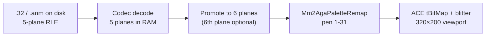

# AGA port plan — graphics, UI, and extension content

Reference for the **Amiga AGA** target of the `game/` remake: how it differs from
retail OCS behaviour, how it relates to the **SDL desktop** dev path, and how
**future UI**, **new art**, and **new dungeons** fit without breaking classic data.

**Status:** planning / architecture (not yet implemented in `game/`).

**Related:** [`game/README.md`](../../game/README.md) · [`06-gfx-loading.md`](06-gfx-loading.md) ·
[`07-anm-tv-format.md`](07-anm-tv-format.md) · [`16-monster-ability-format.md`](16-monster-ability-format.md) ·
[`17-combat-system.md`](17-combat-system.md) · [`15-3d-view-and-game-screen.md`](15-3d-view-and-game-screen.md) ·
[`39-character-ui-view-create.md`](39-character-ui-view-create.md)

---

## 1. Goals (summary)

| Goal | Notes |
|------|--------|
| **AGA-native graphics** | **6 bitplanes** (64 colour indices), not 5bp/32-pen on screen |
| **Planar pipeline** | Decode retail `.32` / `.anm` to **bitplanes**; blit via **ACE**, not full-frame RGBA |
| **Deliberate presentation upgrades** | Multi-monster combat sprites, palette remapping, later UI |
| **Extension content** | New dungeons, tiles, monsters, quests — separate from frozen retail pack |
| **SDL stays for RE** | Fast iteration, ASM cross-check; optional classic 32-colour look |

**Minimum hardware (AGA target):** AGA chipset (A1200 / A4000 / CD32 class), Kickstart 3.x,
enough Chip RAM for 6-plane playfield + multiple BOBs (budget TBD on real hardware).

**Not in scope for AGA target:** ECS-only machines (A500 non-AGA) as primary ship target.

---

## 2. Fidelity split (important)

The repo rule “match 68k exactly” applies to **game logic and classic content**:

- Combat round loop, event VM, `.dat` semantics, movement, rewards — trace ASM.
- Retail `map.dat` / `event.dat` / file bytes — canonical.

The **AGA port** adds a second tier for **presentation and new content**:

| Tier | What | Rule |
|------|------|------|
| **Classic** | Retail data + ASM-traced behaviour | Do not break indices or on-disk formats |
| **AGA presentation** | 6bp, remap, multi-sprite combat, future UI | Documented **intentional deltas** (this file) |
| **Extended** | New maps, art, monsters, UI pack | New IDs, separate files or manifest; never overwrite classic |

Use compile flags / backends, not `#ifdef` scattered magic:

- `MM2_HOST_SDL` — desktop dev
- `MM2_HOST_AMIGA_AGA` (name TBD) — ACE, 6bp, extension palette
- UI: existing `AmigaClassic` vs future backend (e.g. `Agui`) via `ICharacterUi`

---

## 3. Graphics: on disk vs in memory

### 3.1 Retail assets (unchanged on disk)

- **`.32` / `.anm` image chunks:** 5 bitplanes, 32-entry Amiga `0x0RGB` palette, nibble-RLE.
- **Codec:** `EXTRACTED/decomp/mm2_image32_codec.c`, `mm2_anm_codec.c`.
- **Exceptions:** `globe.32` / `disk.32` = XOR string tables; `master.32` = music blob — not tile art.

See [`06-gfx-loading.md`](06-gfx-loading.md), [`07-anm-tv-format.md`](07-anm-tv-format.md).

### 3.2 Original Amiga runtime

- Keeps data **planar**; blits into playfield bitplanes with the blitter.
- **Pen 0** = transparent for sprites/tiles (typical).

### 3.3 Current remake (`game/`, SDL path)

- Codec **rasterizes** each frame to **`frame.rgba`** (chunky 320×200).
- **`ScreenCompositor`** draws RGBA; SDL uploads a texture.
- Convenient for RE; **not** the long-term Amiga path.

### 3.4 Target AGA path

- **Do not** expand every frame to RGBA on Amiga.
- **Do** keep plane pointers (+ palette) for `blitSafeCopy` / BOBs.
- SDL may keep RGBA indefinitely for desktop.

---

## 4. Six bitplanes and 64 colours

| Original (OCS/ECS retail) | AGA port target |
|---------------------------|-----------------|
| 5 bitplanes → 32 indices | **6 bitplanes → 64 indices** |
| Per-sheet 32-word palette | **32 “world” pens** + **32 extension pens** |
| Indexed, not HAM | Standard AGA indexed mode |

**“32 extra colours”** = extension pens **32–63** on top of remapped world pens **1–31**.

ACE: depth-6 `tBitMap`, blitter on all planes; build with AGA-capable toolchain/profile.

---

## 5. Palette zoning (reserve pens for future UI and new art)

Central definition (future): **`Mm2AgaPalette.h`** or generated JSON — **no** hard-coded
“red border = pen 1” scattered in draw code.

| Pen range | Reserved for |
|-----------|----------------|
| **0** | Transparent |
| **1–31** | **World / classic art** — retail `.32` / `.anm` after **remap** (promoted 5→6 bp) |
| **32–47** | **Future UI** — panels, borders, selected/disabled, shadows, chrome |
| **48–63** | **UI accents + FX** — HP/SP bars, status tints, combat HUD, optional text shadow |

**Rules:**

- **Combat multi-monster sprites** use **world** pens (or a per-fight subset of 1–31), not 32–63.
- **New UI** (later) primarily uses **32–63** so it does not fight terrain palettes.
- **New dungeon tile sets** may use world pens (classic feel) **or** extension pens for unique biomes — per-pack choice in the extension manifest.

**Remap table (“moving colours around”):**

- Versioned table: original index → new index for pens 1–31 (fix muddy browns, clearer reds, etc.).
- Extension pens 32–63 defined once in the AGA master palette, not per retail sheet.

---

## 6. ACE integration (platform)

**Backend:** [AmigaPorts/ACE](https://github.com/AmigaPorts/ACE) — blitter, viewport, copper, input, chip/fast mem.

**CMake:** `-DAMIGA=ON` → `PlatformAmiga.cpp` (today: stub). See [`game/README.md`](../../game/README.md).

**Planned platform API** (`mm2::platform`): init, file I/O, input, present — Amiga `present` flips
ACE viewport; no SDL RGBA upload.

**Memory:** `mm2::runtime` / ACE `memAlloc` — no libstdc++ on m68k (`-fno-exceptions -fno-rtti`).

**Entry:** separate from `SDL_main` — ACE generic main or `main_amiga.cpp`.

---

## 7. Font (not Amiga TextFont at runtime)

Retail uses Amiga **TextFont** strike `EXTRACTED/fonts/mm2/8`. ACE does **not** load that.

**Pipeline:**

| Step | Tool / file |
|------|-------------|
| Extract / atlas | `tools/export_mm2_bitmap_font.py` → `editor/assets/fonts/mm2_8.png` + `mm2_8.json` |
| SDL embed | `tools/embed_mm2_font_8.py` → `game/src/gfx/Mm2Font8x8.inc` |
| AGA (done) | Runtime: 1bpp chip glyph mask atlas (128×64) + 8×8 ink stamp; `blitCopyMask` per glyph in `mm2_amiga_planar.c` |

- Include codepoints **0–127** (UI chrome **0x0E–0x15** box glyphs — see `Mm2FontGlyphs.h`).
- On AGA, text draws with **remapped UI pens** (32–63), not RGBA `drawText`.
- CPU planar plot remains as fallback if atlas alloc fails.

ACE doc: [font_conv](https://github.com/AmigaPorts/ACE/blob/master/docs/tools/font_conv.md).

---

## 8. Combat: show multiple monsters (AGA enhancement)

### 8.1 Logic (classic — unchanged)

- Up to **11 monster slots**; parallel arrays `-$11DE[]`, `-$77BE`, etc.
- See [`17-combat-system.md`](17-combat-system.md), [`26-combat-overview.md`](26-combat-overview.md).

### 8.2 Retail presentation (why it feels broken)

- Battle **tracks** all slots, but the **viewport sprite path** does not give each slot its own
  large `.anm` portrait.
- Encounter overlay uses **`0x316E`** and a **24-entry** placement table `A4-$7538` (overworld-style),
  not a per-slot combat gallery.
- Combat view effectively centres on **one** monster graphic (`monsters.dat` byte **0x15**
  `picture & 0x7F` → `NN.anm`) for the fight.

### 8.3 AGA target behaviour (implemented — cap 4)

For each **alive** slot with a distinct `picture` id (first **4** distinct ids):

1. Load **`NN.anm`** via shared `AnmPlanarPool` (chip cel reuse across fights).
2. Place via **`kAgaCombatSpriteLayout[slot]`** in [`AmigaPlayScreenLayout.h`](../../game/include/mm2/gfx/AmigaPlayScreenLayout.h).
3. Blit back-to-front; duplicate `picture` id → one BOB + `xN` stack text.
4. Respect **bit 7** of `picture` (large / placement flag) for disk index (`& 0x7F` only).

**Cap:** **4** distinct sprites (`kAgaCombatSpriteCap`). Raise after Chip RAM measure on hardware.

**Chip RAM:** unreferenced cels stay warm across combat/map hops (avoids reload hitch);
`AnmPlanarPool::acquire()` evicts refcount-0 entries when the 16-slot pool is full.
`purge()` / `clear()` remain for explicit teardown.

---

## 9. Named / boss monsters and art (extension opportunity)

**Observation:** Most **named / boss / story** monsters do **not** have unique combat art. They reuse
the same **`picture` → `NN.anm`** mapping as generic creatures (e.g. dragon, demon, humanoid slots).

- Sprite id is **`monsters.dat` offset 0x15** (`& 0x7F` → `NN.anm`); bit 7 = size/placement flag.
- There is no separate “boss art” field in the 26-byte record.

**Implication for the extension pack:**

- New **`NN.anm`** + new or overridden **`monsters.dat`** rows (extension table) can finally give
  **unique boss portraits** without changing retail records.
- Multi-monster combat display (§8) makes bespoke boss art visible when adds-friends / multi-slot fights occur.

---

## 10. Future UI (planned)

- Today: **`AmigaClassic`** UI backend (ASM-faithful title / roster / `book.32` chrome) on SDL.
- Later: new UI backend on AGA consuming pens **32–63** (panels, states, HUD).
- **Game logic** stays in `Game` / `GameSession` / combat VM — only **draw + chrome** swap.

Benefits of 64 pens for UI:

- Distinct selected / disabled / hover states without stealing terrain colours.
- Clearer borders, status colours, HP/SP bars, future layout not tied to `nwcp.32` / `book.32` sheets.

SDL desktop can keep classic UI for RE; AGA ships new UI when ready.

---

## 11. New artwork and new dungeons (extension pack)

### 11.1 Two content tiers (recap)

| Tier | Contents |
|------|----------|
| **Classic** | Retail `map.dat` (60 screens), `event.dat` (71 locations), all canonical `.dat` / `.32` |
| **Extended** | New screens, locations, tiles, scripts, monsters — **additive** |

Ship as e.g. `data/classic/` + `data/ext/` or one directory with **`content_manifest.json`**.

### 11.2 What a new dungeon requires

| Asset | Tool / doc |
|-------|------------|
| Map screens | `map.dat` append or **`map_ext.dat`** — [`21-map-dat-format.md`](21-map-dat-format.md) |
| Neighbours / env | `attrib.dat` or extension — [`12-attrib-dat-format.md`](12-attrib-dat-format.md) |
| Scripts / strings | `event.dat` new location or **`event_ext.dat`** — [`06-event-dat-format.md`](06-event-dat-format.md) |
| Wall/floor art | New `*.32` (6bp-authored or 5bp + promote) |
| Encounters | Event `OP_12` / `OP_13` — [`35-encounter-tables.md`](35-encounter-tables.md) |
| Monsters | `monsters.dat` row + `NN.anm` — [`16-monster-ability-format.md`](16-monster-ability-format.md) |

**Authoring:** MM2ED (`editor/`) — map, event graph, monsters, gfx preview; round-trip encode is the gate.

### 11.3 Engine conventions (avoid painting into a corner)

- **`MM2_CLASSIC_AREA_COUNT` / `MM2_CLASSIC_EVENT_LOC_COUNT`** — do not scatter magic `60` / `71`.
- **Extended area IDs** ≥ first extended id (document when first pack is defined).
- **Quest / party flags** for new content use **unused flag ranges** — do not collide with classic quest bytes (see FAQ / event docs).
- **Saves:** version field or extension block if extension state is stored.

### 11.4 New art on AGA

- Author at **6 planes** or 8bpp PNG → build tool → 6bp + palette file in manifest.
- UI-only art uses pens **32–63**; dungeon tiles usually **1–31** or extension pens per biome.

---

## 12. SDL vs Amiga — side-by-side

| Aspect | SDL (desktop) | Amiga AGA |
|--------|---------------|-----------|
| Frame buffer | RGBA `ScreenCompositor` | 6-plane `tBitMap` |
| Asset decode | → `frame.rgba` | → planes + palette |
| Font | `Mm2Font8x8.inc` | 1bpp chip atlas + blitter glyph draw |
| UI | `AmigaClassic` / Stub | Classic optional; **new UI later** |
| Combat sprites | RGBA blits (can preview multi-sprite early) | Planar BOBs, multi-slot |
| Classic fidelity | RE reference | Logic yes; presentation per this doc |
| Extension packs | Load for editing / play-test | Native target |

---

## 13. Implementation phases (suggested order)

1. **Doc + constants** — palette zones, classic vs extended counts (this file + headers).
2. **Codec** — retain planes in `mm2_image32_frame`; rasterize only on `MM2_HOST_SDL`.
3. **ACE bootstrap** — init, file read, 6bp screen, one test `.32` blit.
4. **Font** — 1bpp chip glyph atlas + blitter cookie-cut (done).
5. **Palette remap** — load table; apply on blit.
6. **Combat composer** — multi-`NN.anm` layout (AGA, cap 4; done) + `AnmPlanarPool`.
7. **3D viewport** — planar hood on AGA (ASM tables from [`15-3d-view-and-game-screen.md`](15-3d-view-and-game-screen.md)).
8. **Extension loader** — manifest, `map_ext` / `event_ext` when first dungeon is designed.
9. **New UI backend** — after ingame loop stable; uses pens 32–63.

---

## 14. Open decisions (fill in as the port progresses)

| Topic | Decision |
|-------|----------|
| Exact extension area / event id base | TBD |
| Max combat BOBs on screen | **4** (`kAgaCombatSpriteCap`) — raise after Chip measure |
| Per-fight palette merge strategy | Shared pens 3–17 via `AnmPlanarPool` (first overlay wins HW push) |
| `map_ext.dat` / `event_ext.dat` file format version | TBD |
| New UI backend name and ship target | TBD |

---

## 15. Code / doc touchpoints (when implementing)

| Area | Path |
|------|------|
| CMake host switch | `game/CMakeLists.txt` (`AMIGA`) |
| Platform stub | `game/src/platform/amiga/PlatformAmiga.cpp` |
| Image codec | `EXTRACTED/decomp/mm2_image32_codec.{h,c}` |
| SDL compositor | `game/include/mm2/gfx/ScreenCompositor.h` |
| UI plugins | `game/include/mm2/ui/`, `CharacterUiFactory.cpp` |
| Font tools | `tools/embed_mm2_font_8.py`, `tools/export_mm2_bitmap_font.py` |
| Data editor | `editor/` |

---

*Last updated: planning session 2026-06-03 — consolidate AGA port, UI, extension content, and combat art notes.*
