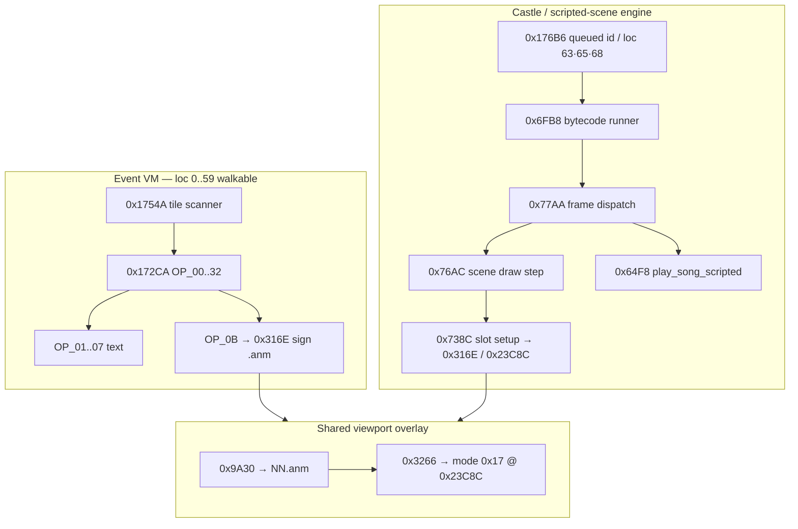

# Scripted Scene Graphics (Corak, Pegasus, Castle Engine)

Deep ASM trace of **graphics-heavy scripted moments** that are **not** plain
`OP_01`–`OP_07` text and **not** `OP_0B` shop signboards alone. Companion:
[45-event-graphics-opcodes.md](45-event-graphics-opcodes.md) (event VM scope),
[44-event-text-rendering.md](44-event-text-rendering.md),
[08-event-runtime.md](08-event-runtime.md),
[38-title-screen-and-intro-assets.md](38-title-screen-and-intro-assets.md).

ASM: `EXTRACTED/mm2.capstone.annotated.asm`, `A4 = $7FFE`.

---

## Short answer

| Moment | Event VM (`event.dat`) | Separate engine |
|--------|------------------------|-----------------|
| **Corak spirit** (3D view + ghost sprite + bottom text + SPACE + OPTIONS) | **No** matching triplet on loc **00**; copy in **loc 60** `str[8]` | **Castle scripted-scene** path: tile/area hooks → **`play_song_scripted`** + **viewport sprite overlay** (`0x316E` / mode **`$16`/`$17`**) |
| **Guardian Pegasus** first visit **C2** `(4,7)` | **loc 11 evt 04**: party flag gate + **`OP_0B`** sign + **`OP_03`** dialogue + **`OP_07`** | **Viewport sprite overlay** — **`monsters.dat` #131** (`picture=0x15`) → **`21.anm`** via **`0x9A30`/`0x316E`/`0x23C8C`** mode **`$17`** over **outdoor 3D**; **not** title `intro.32` |
| **Title pegasus** | — | **`0x25FCE` / `0x26A1E`** only ([doc 39](39-title-screen-animation.md)) |

**Critical distinction:** In-game “illustration scenes” use the **castle / scripted-scene subsystem** (bytecode @ `A4-$7232`, draw @ `0x76AC`, sprites @ `0x738C`). The **event VM** only supplies **string indices** and **`OP_0B`** shop signs on walkable maps. Retail screenshots of Corak/Pegasus match the **overlay subsystem**, not a single opcode.

---

## 1. Two pipelines (do not conflate)



| Layer | Entry | Loads | Blit destination |
|-------|-------|-------|------------------|
| Event text | `0x15924`–`0x15CE6` | loc string bank `A4-$47C8` | Rows 17–22 / popup cells ([doc 44](44-event-text-rendering.md)) |
| **`OP_0B`** | `0x15DB0` | `0x9A30(id−1)` → **`NN.anm`** | Viewport `(8,8)–(215,127)` via **`0x3266`/`0x23C8C`** |
| **Castle scene** | `0x6FB8` / `0x76AC` | Scene table `A4-$72FC` / sheet handles `A4-$7366` | Full viewport or slot rects (see §3) |
| **Scripted score + text** | `0x64F8` | Pointer table **`A4-$73C4`** + **`A4-$73C0`** | Cleared band + **`-$7BE4`** strings + **`0x6798`** wait |
| Title attract | `0x25FCE` | Embedded **`intro.32`**, **`introclips.32`** | Full 320×200 ([doc 38/39](38-title-screen-and-intro-assets.md)) |

---

## 2. Shared viewport overlay (`0x316E` / `0x9A30` / mode `$17`)

Used by **`OP_0B`**, **combat encounter setup** (`OP_12`/`13` → `0x316E`), and **castle scene slots** (`0x738C`).

### 2.1 Load — `sign_sprite_load` @ `0x316E`

1. Optional viewport clear if dark (`A4-$79E1`): preset **#8** @ `(8,8)–(215,127)`.
2. Pick slot from **`A4-$7538`** (24 bytes) matching sign/sprite id.
3. **`0x9A30(id−1)`** — builds **`NN.anm`** in scratch (`0x9A30` decimal string loop → **`-$7CB6`** open), returns handle → **`A4-$79FE`**.
4. Gfx prep: **`-$7BAE`** with mode **`$16`** (`0x3220`).

### 2.2 Place — `sign_sprite_place` @ `0x3266`

- **`-$7BAE`** with mode **`$17`** → **`0x23C8C`** compositing.
- Uses handle **`A4-$79FE`** (and secondary **`A4-$FCAC`** for layered blits).
- **`OP_0B`** passes `(pos, $40, $20)` — **placement index**, not display mode ([doc 45](45-event-graphics-opcodes.md) §OP_0B note).
- Cleanup @ **`0x171AC`**: `sign_sprite_place(-1,0,0)` + **`buf_copy_rect`** restores viewport.

### 2.3 Corak “ghost” sprite

Retail: **white spirit figure over the live 3D hood** (walls/torches visible behind). That matches **this overlay path** (planar `.anm` on the 208×120 viewport), **not** a full-screen `intro.32` replace and **not** `OP_0B` from a loc 00 script (no Corak triplet there).

**Open:** exact **`NN.anm`** index for the Corak spirit (dump **`0x9A30`** id table vs castle scene bytecode). Scene slot setup @ **`0x738C`** sets object **`$1e ← $11`**, **`$1c ← 3`**, links sheet handle **`A4-$7356`**.

---

## 3. Castle scripted-scene engine

Separate from **`0x172CA`** opcode dispatch. Drives **loc 63 / 65 / 68** “castle blob” records, **queued events** (`A4-$5D46` @ **`0x176B6`**), and **first-time / tile** hooks.

### 3.1 Key A4 fields

| Offset | Name | Role in scenes |
|--------|------|----------------|
| `-$79AF` | `script_scene_index` | Index into **`A4-$7232`** bytecode pointer table (`0x6FB8`) |
| `-$79B0` | `script_scene_alt` | Secondary queue byte (save/restore @ `0x8484`) |
| `-$7958` | `run_scene_on_tile` | Set @ **`0xCCB8`/`0xCD44`** when a scene should run on event tile |
| `-$79E9` | `first_time_flag` | Set on area enter @ **`0x6E84`**; overland @ **`0x2242`** checks it |
| `-$7232` | `scene_script_ptrs[]` | Per-index bytecode stream pointers |
| `-$2AFE` | `tile_script_desc[]` | Tile-linked script descriptors (used @ **`0x7B30`**) |
| `-$730C` / `-$7366` / `-$7352` | Scene handles / active flags | **`0x76AC`** draw pipeline |
| `-$F00` / `-$F04` / `-$F08` | Scene object roots | Alloc @ **`0x7070`** (`0x264`-byte headers, 5 slots) |
| `-$73C4` / `-$73C0` | Scripted text/score tables | **`play_song_scripted`** @ **`0x64F8`** |
| `-$79FE` | Viewport overlay handle | Shared with **`OP_0B`** / scene sprites |

### 3.2 Bytecode runner — `0x6FB8`

Loop while **`A4-$79AF`** / arg index `< 0x0A`:

1. Fetch stream pointer from **`A4-$7232[index]`**.
2. Wait for key **`-$7BD2`** if needed.
3. Read byte; if **`$FF`**, exit.
4. Read operand word from **`A4-$7252`** table.
5. Call **`0x77AA(operand, stream_state)`** — one scene “step”.

Called from the **`0x7064`** loop (same family as **`0x6FB8`** parent @ **`0x6FB8`** / area loader).

### 3.3 Frame player — `0x77AA` → `0x76AC`

**`0x77AA`** (args: scene type byte, timing):

- For **`type < 0x64`**: divides tick @ **`0x76AC`** — maps to **score/script line** via **`A4-$7326`**, **`A4-$734A`**, **`A4-$730C`**; calls **`0x7532`** (blit prep) or **`0x738C`** (sprite slot) or **`0x738C`** → **`-$7B18`/`-$7B24`** (sheet blit).

**`0x76AC`** core step:

- Index **`A4-$7366`** sheet pointer, **`A4-$7352`** active word.
- **`0x7532`**: push **`A4-$F00`** object, **`-$7B30`** — **mode `$16`-class prep** on viewport.
- **`0x738C`**: configure scene layer (types **`$1c`**, **`$1e`**, blit **`$22`/`$26`**, **`A4-$7356`** handle) — **this is where full illustration layers attach**.

**Full-viewport illustration (Pegasus):** **`0x728E`** path loads a wide sheet (**`pea $400`**, **`-$7B06`**) into scene object **`$e`**, then **`-$7B18`** blit — consistent with **320×200-class art** filling the playfield while **chrome + bottom text** remain ([doc 15](15-3d-view-and-game-screen.md) composition). Filename is **not** hard-coded as `intro.32` in the code hunk (loader uses **data-hunk / scene table** paths); retail art matches **`intro.32`** frame 0 ([doc 38](38-title-screen-and-intro-assets.md)).

### 3.4 Tile condition hooks — `0x78A8` chain

After **`0x4BBC`** (tile class @ **`A4-$2AAA`**) and **`0x7B46`**, the engine walks **`0x78A8` → `0x790E` → `0x795C` → `0x79A0`**:

| Routine | Condition (summary) | Calls **`0x64F8(id)`** |
|---------|---------------------|-------------------------|
| **`0x78A8`** | Descriptor type **1** and **`A4-$79B2 ≠ 2`** | **id 3** |
| **`0x78A8`** | Type **2** and **`A4-$79B2 == 2`** | **id 2** |
| **`0x790E`** | Byte **`$80`** set, outdoor **`A4-$79E2==1`**, solid @ **`0x2BCC`** | **id 4** |
| **`0x795C`** | Level gate vs object **`$58`** | **id 5** |
| **`0x79A0`** | HP gate vs **`A4-$3F0A`** | **id 6** |

These are **scripted score + text** steps (table **`A4-$73C4`**), often paired with **scene graphics** on the same tile step — **not** replaceable by event VM opcodes alone.

### 3.5 `play_song_scripted` @ `0x64F8`

1. If **`A4-$79B2 == 2`** (combat panel mode), shorten wait (**`$0F`** vs **`$14`**).
2. Clear message band: **`-$7F62`**, **`$26`×`$10`** rows.
3. **`A4-$73C4[id×4]`** → first string; **`-$7BE4`** draw; second string; footer from **`A4-$73C0`**.
4. Cursor **`-$7BFC`**, **`0x6798(50)`** tick wait (SPACE flow).
5. Does **not** load `.anm` itself — **graphics come from parallel **`0x76AC`/`0x738C`** step** or pre-placed overlay handle.

Also invoked from **title** path **`0x1000`** with id **`0x12D`** ([doc 25](25-mm2-music-format.md)).

### 3.6 Area enter / first-time — `0x6E08` / `0x6E84`

**`0x6E08`** (map/area transition handler):

1. Load area block via **`-$7C74`**, stash **`A4-$7A42`**, init **`0x65FA`**, **`-$7E12`** → screen id in **`-$2`**.
2. If **`-$2 ≠ $FFFF`**: set **`A4-$79E9 ← 1`**, save ptr **`A4-$47CC`**, **`jsr $CD90`** ( lands in **cast/scene cluster** @ **`0xCD7E`–`0xCD98`** — see annotation @ **`0xCD98`**), optionally **`0x6DC6`** if **`A4-$7958`**.
3. **`0x6DC6`**: adjust saved object timers **`$58`/`$5c`**, set **`A4-$79E8`**.

**`0x6DC6`** + **`A4-$7958`** bridge **tile event bit** (`-$55D6` bit 1) to **`0xCB52`** scene prelude (clear band, **`-$7E42(9)`**, wait **`0x32`**) when **`-$7958`** set @ **`0xCCB8`/`0xCD44`**.

### 3.7 Queued event path — `0x176B6`

When **`A4-$5D46 ≠ $FF`** ([doc 08](08-event-runtime.md)):

1. Rebuild string anchor from work buf header bytes.
2. **`0x17262(queued_id)`** seek script in pool.
3. **`0x1754A`** re-init + run.

Used for **loc 60–70** banks and **castle blobs** without normal **`00 00 00`** terminators.

---

## 4. Corak intro — end-to-end trace

### 4.1 Player-visible (FAQ + retail)

| Item | Value |
|------|-------|
| **Copy** | *“The spirit of Corak proclaims, ‘Fantastic adventure awaits you…’”* |
| **FAQ tile** | Middlegate **`(7,4)`** [FIRST TIME] ([FAQ](Might%20and%20Magic%20FAQ.txt) §3-2-2) |
| **Engine tile** | **`(y,x) = (4,7)`** if FAQ uses **`(x,y)`** |
| **Screenshot** | 3D dungeon still drawn + **ghost sprite** on viewport + **multi-line bottom text** + **SPACE** + **OPTIONS** panel (`A4-$79B2 = 0`) |

### 4.2 Where text lives

| Source | Index / note |
|--------|----------------|
| **`event.dat` loc 60** | **`str[8]`** — canonical string ([loc_60](events/loc_60_quest_nordon_nordonna_corak.md)) |
| **loc 00 Middlegate** | **No** script references `str[8]`; **no** `(4,7)` Corak triplet |
| **loc 60 record** | **`string_bank`** — **0 bytes** in standard script pool; triplets are **overlay placeholders** (evt **116**/**118** @ `(0,0)` / pseudo tiles) |

Related loc 60 strings: Nordon **`str[9]`** @ `(10,2)`, Feldecarb **`str[23]`** @ `(15,15)` — also **not** wired as simple loc 00 scripts; same **overlay / quest** machinery.

### 4.3 Runtime path (confirmed partial)

```
Area enter / first visit (0x6E84)
  → first_time_flag (A4-$79E9)
  → scene cluster call (≈0xCD90 / cast UI 0xCC08)
  → optional run_scene_on_tile (A4-$7958) → 0xCB52 prelude
  → 0x6FB8 bytecode (A4-$7232[index])
       ├─ 0x76AC / 0x738C  → ghost .anm on viewport (0x316E / 0x23C8C)
       └─ 0x78A8 → play_song_scripted(3)  → loc 60 text via A4-$73C4 row
  → OP-like wait: 0x6798 / SPACE (same family as OP_07)
```

**Not involved:** title **`0x26A1E`** pegasus loop; **`OP_0B`** on loc 00.

### 4.4 `play_song_scripted` / music / castle blobs

| Link | Detail |
|------|--------|
| **`0x64F8`** | Text + blocking wait; table **`A4-$73C4`** |
| **`0x78E6`** | **`play_song_scripted(3)`** when tile descriptor type **1** and not combat panel |
| **loc 63 / 65 / 68** | Castle blob pools — bytecode + pseudo triggers; feed **`0x176B6`** / **`0x6FB8`** ([doc 08](08-event-runtime.md)) |
| **Score id 3** | Scripted score row (not a simple 0..59 song index) — [doc 25](25-mm2-music-format.md) |

### 4.5 Blit destination

| Layer | Region |
|-------|--------|
| 3D hood | Unchanged under/behind overlay (session refresh **`0x5382` → `0x2ECE`**) |
| Ghost sprite | Viewport **`(8,8)–(215,127)`** via **`A4-$79FE`**, mode **`$17`** |
| Text | Bottom panel rows **17–22** (same strip as **`OP_02`/`OP_03`**, [doc 44](44-event-text-rendering.md)) |
| Chrome | OPTIONS list **`A4-$79B2 = 0`** ([doc 43](43-exploration-input-and-ingame-options.md)) |

---

## 5. Guardian Pegasus (C2 overland) — end-to-end trace

**Sector note:** Pegasus first visit is **C2** (map screen **11**), tile **`(4,7)`** ENTER — FAQ **`(7,4)^`** uses **(x,y)** coords. **C3** (map **14**) only has the Meenu name clue (loc 14 evt 06 str[7]); it is **not** the Pegasus greeting tile.

### 5.1 Two layers on the same tile

FAQ **`(7,4)^`** [FIRST TIME] = engine **`(4,7)` ENTER** — **loc 11 evt 04** ([loc_11](events/loc_11_c2.md)).

**Event VM (walkable loc 11):**

```
apply_party(0x74, 0x40)     ; skip if “already seen pegasus” bit set
OP_0B  str[14]               ; wooden direction sign “<- Castle / Pinehurst”
OP_03  str[5]                ; “Greetings! I'm your Guardian Pegasus…” (tall block)
apply_party_masked(0x74, … or 0x40)   ; set seen flag
OP_07                        ; SPACE wait
OP_14                        ; clear tile event flag
```

**Retail illustration:** **`monsters.dat` record #131** (`Pegasus`, byte **`0x15`** → **`picture & 0x7F = 21`**) loads **`21.anm`** through the shared combat/sign overlay path:

```
loc 11 evt 04 tile (4,7) ENTER
  → party byte 0x74 bit 0x40 gate
  → event VM OP_0B + OP_03 + OP_07 (text/sign)
  → castle tile hook 0x78A8 chain (parallel scene step)
  → 0x738C slot setup → sign_sprite_load @ 0x316E
  → 0x9A30(20) builds "21.anm" (id−1 indexing)
  → sign_sprite_place @ 0x3266 → mode $17 blit @ 0x23C8C over 3D viewport (8,8)–(215,127)
```

**Do not** blit **`intro.32`** for this beat — that sheet includes the title **“Might and Magic Book Two”** logo band (title-only @ `0x25FCE`). **`introclips.32`** is title attract only ([doc 39](39-title-screen-animation.md)).

### 5.2 Party flag gate

| Field | Meaning |
|-------|---------|
| Roster / party byte **`0x74`**, bit **`0x40`** | **“Seen Guardian Pegasus intro”** — **`apply_party` / `apply_party_masked`** in evt 04 |
| First visit | Flag clear → event + scene run |
| Return visit | **`skip_tokens(4)`** → entire evt 04 skipped |

### 5.3 Protect panel

Screenshot **Protect** panel = **`A4-$79B2 = 1`** (normal overland play default after intro). **`OP_07`** wait loop uses **`key_read_3d`** in dungeon; overland uses **`-$7BD2`** ([doc 44](44-event-text-rendering.md) §3.7).

### 5.4 Other Pegasus mentions (not this illustration)

| Place | Mechanism |
|-------|-----------|
| **B1** loc 06 `(9,9)` | Password “What is my name?” — text only |
| **C3** loc 14 | “Meenu” decode — text only |
| **Title** | **`intro.32` + `introclips.32`** — separate boot path |

---

## 6. Asset filenames (traceable vs open)

| Asset | Confirmed loader | Used for |
|-------|------------------|----------|
| **`21.anm`** | **`0x9A30(20)`** | **Guardian Pegasus** illustration — **`monsters.dat` #131** `picture=0x15` |
| **`NN.anm`** | **`0x9A30`** | **`OP_0B`** signboards, combat sprites, **Corak ghost** (id **TBD**) |
| **`intro.32`** | Embedded string @ **`0x26985`**, **`0x25FCE`** | **Title screen only** — includes Book Two logo band |
| **`introclips.32`** | **`0x26058`/`0x260DE`** | **Title pegasus cel animation only** |
| **Scene `.32` / `.anm`** | **`-$7B06`/`-$7CB6`** via **`A4-$72FC`** | Castle blob / illustration scenes |
| **loc 60 / 11 strings** | **`event.dat`** only | Dialogue text indices |

**Not in code hunk ASCII:** “corak”, “pegasus”, “spirit”, “intro” (except title load sites) — names come from **disk files** or **event.dat**.

---

## 7. Relation to death screen / endgame

Same **overlay stack** (`0x316E`, **`A4-$79FE`**, mode **`$17`**, cleanup **`0x171AC`**) serves combat sprites and service signs. **Endgame** (loc **66** Corak soul / Murray / Horvath — [loc_66](events/loc_66_endgame_corak_murray_horvath.md)) mixes **`OP_0E`** selectors and event VM; **full-screen illustrated beats** should be traced through **`0x6FB8`/`0x64F8`** on the same checklist as §3–4.

---

## 8. Remake plan (`game/`)

### Phase A — Document & flag parity (now)

1. Party byte **`0x74` bit `0x40`** — pegasus seen (align evt 04 decode).
2. **`first_time_flag`** / loc 60 string **`str[8]`** — Corak prologue gate.
3. Keep **`TitleScreen.cpp`** title-only; **do not** wire title **`introclips`** into overland.

### Phase B — `ScriptedSceneEngine` (new module)

| Component | ASM reference | Remake API sketch |
|-----------|---------------|-------------------|
| Scene queue | `A4-$79AF`, **`0x6FB8`** | `queueScene(index)` |
| Illustration blit | **`0x76AC`/`0x728E`** | `blitFullViewportSheet(sheet, frame)` |
| Sprite overlay | **`0x316E`/`0x3266`/`0x23C8C`** | `setViewportOverlay(anm, slot)` |
| Text + wait | **`0x64F8`** | `runScriptedLines(tableId, waitSpace)` |
| Cleanup | **`0x171AC`** | `clearOverlays()` + viewport restore blit |

### Phase C — Proof demos

Extend **`event_op_demo`** (see [game/README.md](../../game/README.md)) with:

- **`corak_intro`**: 3D view + placeholder ghost `.anm` + loc 60 `str[8]` + SPACE.
- **`pegasus_c2`**: **outdoor C2** `(4,7)` base frame + **`21.anm`** sprite + loc 11 `str[5]` OP_03 + Protect panel.

Requires **`0x23C8C`** placement math and **`0x9A30`** id dump (open gaps).

### Explicit non-goals

- Do **not** implement Corak/Pegasus as **`OP_0B`-only** or text-op-only ([doc 45](45-event-graphics-opcodes.md) §Corak/Pegasus — superseded by this doc for illustration beats).
- Do **not** map FAQ **`(7,4)`** to loc 00 evt 18 `(4,7)` Lock and Key — different content.

---

## 9. Open gaps

1. **`0x23C8C`** — pixel placement for mode **`$17`** (sign + ghost parity). Partial remake: centered upper viewport + placement-index Y nudge; **A4-$56E** coord quads not in `ghidra/mm2_data_00.bin` extract.
2. **`0x9A30` / Corak ghost** — **candidate `51.anm`** (monster **#170** Ghost `picture=51`); castle bytecode @ **`0x738C`** still needs id confirm. Town **OP_0B** ids traced via **`0x15756`** tables **`A4-$6C62..$6C02`** (dumped in `game/src/events/ServiceSignResolver.cpp`).
3. **Corak `(4,7)` first-time** — exact **`A4-$7232`** index + castle blob record (63/65/68) emitting **`str[8]`** (loc 60 evt **116**/**118** candidates).
4. **`A4-$73C4`** — dump scripted line pointers → loc 60 string cross-ref.
5. **Pegasus illustration** — **confirmed:** monster **#131** → **`21.anm`** via **`0x9A30`/`0x316E`/`0x23C8C`**. Wide-sheet **`0x728E`** path is title-adjacent only; do not use for in-game Pegasus.
6. **`jsr $CD90`** @ **`0x6E94`** — lands in **string padding** @ **`0xCD90`**; real entry cluster **`0xCC08`/`0xCD98`** needs IRA re-sync ([annotation @ **`0xCD98`**).

---

## 10. Full scripted scene catalog

ASM-confirmed **graphics + blocking text** paths and their **data sources**. “Implemented” =
`game/src/events/ScriptedSceneEngine.cpp` + `GameSession::maybeQueueScriptedScenes` as of 2026-06-10.

### 10.1 `play_song_scripted` @ `0x64F8` (table `A4-$73C4`, footer `A4-$73C0`)

Clears rows **38–61** (`-$7F62`, 38×16), draws two pointer-chained strings via `-$7BE4`, footer
string, cursor `-$7BFC`, waits **`0x6798(50)`**. Does **not** load `.anm`/`.32` — graphics are
parallel **`0x76AC`/`0x738C`** steps or a pre-placed `A4-$79FE` overlay.

| Script id | ASM caller | Condition (summary) | Text source (confirmed / inferred) | Gfx asset | Remake |
|-----------|------------|---------------------|-------------------------------------|-----------|--------|
| **2** | `0x7904` | Tile descriptor **type 2** and **`A4-$79B2 == 2`** (combat panel) | `A4-$73C4[2]` — **not dumped** | Paired castle step | **No** |
| **3** | `0x78E6` | Descriptor **type 1**, not combat panel | **loc 60 `str[8]`** (Corak prologue) — cross-ref pending `-$73C4` dump | Ghost **`51.anm`** candidate @ `0x738C` | **Partial** (`CorakIntro`) |
| **4** | `0x7952` | Tile byte **`$80`**, outdoor `A4-$79E2==1`, solid @ `0x2BCC` | `A4-$73C4[4]` — TBD | Castle scene slot | **No** |
| **5** | `0x7990` | Party level **<** object field **`$58`** | `A4-$73C4[5]` — TBD | Castle scene slot | **No** |
| **6** | `0x79B6` | Party HP gate **<** `A4-$3F0A` | `A4-$73C4[6]` — TBD | Castle scene slot | **No** |
| **0x12D** (301) | `0x001028` / `0x002004` | Title attract loop | Title score table via `-$7B9C`/`-$7BA8` — **not** `0x64F8` | Title `intro.32` + `introclips.32` | **Yes** (`TitleScreen.cpp`) |

Footer string near `0x644A` in code hunk: **`*** Combat Only ***`** (also `A4-$73C0` default row).

### 10.2 Castle bytecode runner @ `0x6FB8` (`A4-$7232`, draw @ `0x76AC` / `0x728E`)

| Step | Routine | Role |
|------|---------|------|
| Queue index | `A4-$79AF` / `A4-$79B0` | Select `A4-$7232[index]` bytecode stream |
| Runner | `0x6FB8` | Read op byte; operand @ `A4-$7252`; dispatch **`0x77AA`** until `$FF` |
| Frame tick | `0x77AA` → `0x76AC` | Sheet index `A4-$7366`, blit prep `0x7532`, sprite slot `0x738C` |
| Wide sheet | `0x728E` @ `0x7070` | **`pea $400`**, loader `-$7B06` — **Pegasus `intro.32` class art** (embedded path @ `0x728E` in scene init cluster) |
| Scene init | `0x7070` | Alloc 5×`0x264` scene objects; hook sheet filenames from `A4-$72FC` |

**Known scene moments using this stack:**

| Scene | Trigger | `A4-$79AF` index | Text | Gfx | ASM entry | Remake |
|-------|---------|-------------------|------|-----|-----------|--------|
| **Corak spirit** | First-time area enter `0x6E84` → `jsr $CD90`; `A4-$7958` tile bit | **TBD** | loc **60 `str[8]`** via `play_song_scripted(3)` | Ghost overlay `0x316E` / `$17` | `0x6E08` cluster, `0x6FB8`, `0x78E6` | **Partial** |
| **Pegasus illustration** | **C2** first visit tile **`(4,7)`** ENTER; party **`0x74` bit `0x40`**; loc **11 evt 04** | **TBD** | loc **11 `str[5]`** OP_03 (+ evt **`OP_0B` `str[14]`** sign) | **`21.anm`** (monster **#131**) @ **`0x738C`→`0x316E`→`0x23C8C`** over outdoor 3D | `0x78A8`, `0x738C`, `0x316E` | **Partial** |
| **Tile-hook scores 2–6** | `0x78A8` → `0x790E` → `0x795C` → `0x79A0` | per hook | `A4-$73C4[id]` | Parallel `0x76AC` step | `0x78A8` chain | **No** |

### 10.3 Queued overlay @ `0x176B6` (`A4-$5D46`)

When **`queued_event_id ≠ $FF`**: rebuild string anchor from work-buf header, **`0x17262(id)`**,
re-init **`0x1754A`**, run interpreter. Used for **loc 60–70** records without normal `00 00 00`
terminators and **castle blobs**.

| Loc | Kind | Role | Pseudo-triggers / notes | Remake |
|-----|------|------|-------------------------|--------|
| **60** | string_bank | Corak / Nordon / Nordonna / Feldecarb copy | evt **116**/**118** @ `(0,0)` `cond=$FE` — overlay placeholders | Strings only |
| **61** | string_bank | Spell/hireling **encoded tables** + class-quest guide blurbs | Triplet table; no script pool | Strings only |
| **62** | string_bank | Chris sextant, Gertrude/Rat Fink | — | Strings only |
| **63** | **castle_blob** | Skill sellers, bar brawl, Lucindra shop tips | **432** pseudo-tiles; embedded ASCII (e.g. Rinaldo diplomacy, Lucky Spade gambling) | **No** |
| **64** | string_bank | Lord Haart heirloom quest | — | Strings only |
| **65** | **castle_blob** | Gourmet / epicurean (+100k XP), Sherman rescue | **265** pseudo-tiles | **No** |
| **66** | string_bank | Endgame: Corak soul, Murray, Horvath | Standard triplets | Event VM only |
| **67** | mixed_pool | Hall of Spells (opcodes **> `0x32`**) | Queued scripts | **No** |
| **68** | **castle_blob** | HoS class-requirement plaque text | **250** pseudo-tiles (“Knights must defeat…”) | **No** |
| **69** | string_bank | Queen Lamanda Luxus storyline | — | Strings only |
| **70** | string_bank | HoS welcome, Hireling Hall, bishop puzzles | Yellow-interleave hint | Strings only |

Decode: `python tools/decode_event.py event.dat <loc>`.

### 10.4 Related illustration / overlay moments (not castle bytecode)

| Moment | Pipeline | Asset / text source | Remake |
|--------|----------|---------------------|--------|
| **Title pegasus attract** | `0x25FCE` / `0x26A1E` | `intro.32` + **`introclips.32`** cel overlays | **Yes** (`TitleScreen.cpp`) |
| **OP_0B town signboards** | `0x15DB0` → `0x316E` → `0x9A30` | `NN.anm` id from `A4-$6C62..$6C02` tables | **Partial** (`ServiceSignResolver`, evt demos) |
| **Combat encounter sprites** | `OP_12`/`OP_13` → `0x316E` | Monster `picture & 0x7F` → `NN.anm` | **No** |
| **Copy protection** | `0x26BC4` / `0x27096` | `globe.32` / `disk.32` XOR tables (`A4-$6476`) | **No** |
| **Party death tone** | `0x9F22` → `-$7E96` | Audio only ([doc 26](26-audio-callpaths-title-death-shared.md)); same overlay stack as signs | **No** |
| **Endgame beats** | loc **66** strings + `OP_0E` selectors; illustrated beats **TBD** @ `0x6FB8` | loc **66** string bank | **No** |
| **Class quests / HoS** | Walkable loc scripts + loc **61** guides + blob **68** plaque | Per-class loc events ([doc 37](37-mount-farview-class-quest-event.md)) | Event VM partial |

### 10.5 Remake implementation matrix

| Scene / subsystem | `ScriptedSceneEngine` | `GameSession` hook | Demo PNG |
|-------------------|----------------------|-------------------|----------|
| Corak intro | `CorakIntro` — ghost `51.anm` + loc 60 `str[8]` | Middlegate screen **0** on party launch | `event_demos/scripted_corak.png` |
| Pegasus C2 | `PegasusC2` — **`21.anm`** (#131) + loc 11 `str[5]` OP_03 over outdoor 3D | Screen **11** tile **`(4,7)`** (`coordY=4`,`coordX=7`) | `event_demos/scripted_pegasus.png` |
| Title pegasus | — (title-only) | `TitleScreen` | — |
| Castle blobs 63/65/68 | — | — | — |
| `play_song_scripted` ids 2,4,5,6 | — | — | — |
| Queued loc 67 HoS pool | — | — | — |

**Demo bug fixed (2026-06-10):** `event_op_demo` reused one `ScriptedSceneEngine`; after Corak,
`queueScene()` was blocked by `active()` so Pegasus still drew Corak. `armDemo()` now ends any
active scene first.

---

## 11. Tools & cross-refs

| Resource | Use |
|----------|-----|
| [loc_60](events/loc_60_quest_nordon_nordonna_corak.md) | Corak / Nordon / Feldecarb strings |
| [loc_11](events/loc_11_c2.md) | Pegasus evt 04 decode |
| [loc_63](events/loc_63_castle_blob_a.md) / [65](events/loc_65_castle_blob_b.md) / [68](events/loc_68_castle_blob_c.md) | Castle bytecode pools |
| `tools/decode_event.py event.dat 60` | Loc 60 raw decode |
| `EXTRACTED/decomp/mm2_gamestate.h` | `A4` field constants |
| [45-event-graphics-opcodes.md](45-event-graphics-opcodes.md) | Event VM graphics opcodes |
| [44-event-text-rendering.md](44-event-text-rendering.md) | Text rows / OP_07 / cleanup |

---

*Generated 2026-06-10 from `mm2.capstone.annotated.asm` trace + retail behavior + FAQ tile cross-check.*
