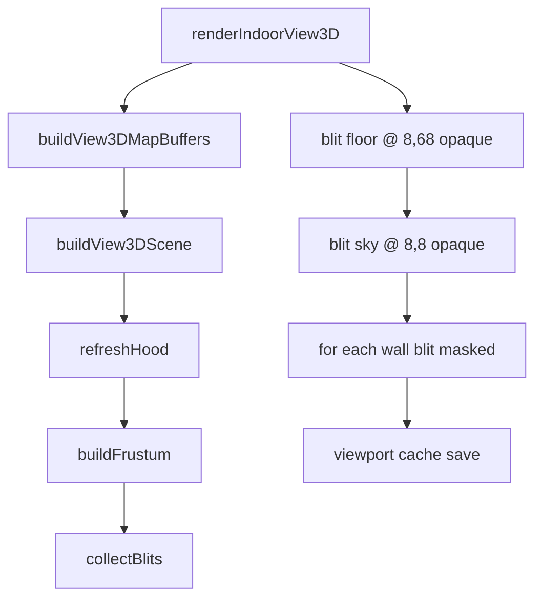

# Amiga C++ Play Screen — Per-Frame and Per-Movement Draw Walkthrough

This document describes **how the remake’s Amiga C++ code actually draws the exploration play screen**, step by step:

- what runs on **every display frame** (even when nothing changed),
- what runs **only after movement or other state changes**, and
- how the **3D viewport** is built and blitted into ACE bitplanes.

It is written against the current `game/` tree (`MM2_HOST_AMIGA`). For original 68k ASM behaviour, see [`15-3d-view-and-game-screen.md`](15-3d-view-and-game-screen.md). For a high-level RE summary, see [`47-amiga-3d-render-process.md`](47-amiga-3d-render-process.md).

---

## 1. Key files

| Role | File |
|------|------|
| Main loop | `game/src/states/mm2_app_run.cpp`, `game/src/states/mm2_states.cpp` (`in_town_loop`) |
| Input → movement → draw orchestration | `game/src/states/AppHost.cpp`, `game/include/mm2/GameSession.h` |
| Movement (turn / step) | `game/src/gameplay/Movement.cpp` |
| Map sampling for 3D | `game/src/world/MapWorld.cpp` |
| Indoor frustum + blit list | `game/src/gfx/View3D.cpp`, `game/include/mm2/gfx/View3D.h` |
| Outdoor horizon + decor | `game/src/gfx/OutdoorView3D.cpp` |
| Play-screen chrome + text | `game/src/gfx/PlayScreenChrome.cpp`, `game/src/gfx/ScreenCompositor.cpp` |
| Tileset loading | `game/src/gfx/EnvAssets.cpp` |
| Amiga bitplane blits + viewport cache | `game/src/platform/amiga/mm2_amiga_planar.c` |
| Layout constants | `game/include/mm2/gfx/AmigaPlayScreenLayout.h` |

---

## 2. Screen layout (where things go)

The play screen is **320×200**. The first-person window is a **208×120** rectangle anchored at **(8, 8)** — sky band on top, floor band below.

| Region | Origin | Size | C++ constant |
|--------|--------|------|--------------|
| 3D viewport | (8, 8) | 208×120 | `kView3DOriginX`, `kView3DSkyY`, `kView3DFloorY` in `View3D.h` |
| Sky / ceiling backdrop | (8, 8) | 208×60 | blit frame 0 or 1 of `env_.sky()` |
| Floor backdrop | (8, 68) | 208×60 | blit frame 0 of `env_.floor()` |
| Red border + HUD | font grid 40×24 | 8×8 cells | `PlayScreenChrome.cpp` |
| Right column | cols 0x1C–0x26 | Protect / command ref | `drawPlayRightColumn()` |

On Amiga, **`.32` sprites are blitted directly into the ACE back buffer** (`pBack`). The `ScreenCompositor` does **not** hold an RGBA framebuffer on Amiga — it forwards clears, rects, and glyphs to `mm2_amiga_*` pen plotters.

---

## 3. One display frame — main loop

Every iteration of the in-game state:

```
mm2_app_run()
  pollInput()                    → keys_ updated
  in_town_loop()
    inTownStep()                 → logic (movement, events, …)
    inTownDraw()                 → draw if dirty
    framePresent()               → vblank + buffer swap
```

### 3.1 `inTownStep()` — logic only, no drawing

`AppHost::inTownStep()` calls `GameSession::tick(keys_)`.

Inside `tick()` (simplified order):

1. **`tickOverlayAnimations()`** — advance `.anm` cels (scripted scenes, event portraits). If a cel changed → `markOverlayAnimDirty()` on Amiga.
2. If a **scripted scene** is active → handle it and return (may `markDirty()` or `markView3DDirty()` on exit).
3. If an **event blocks movement** → `tickEventInput()` and return.
4. If a **modal overlay** is open (Quick Ref, automap, …) → `tickOverlayInput()`.
5. Else **exploration input**:
   - Command keys (Protect, Rest, …) via `tickPlayInput()`.
   - Turn / step via `pollExploreCode()` → `gameplay::turn()` or `gameplay::step()` → **`refreshWorldAfterMove(move)`**.
6. **`runPendingEvents()`** — tile events after movement latch.
7. **`refreshWorldAfterEventTransition()`** — reload env if an event changed map screen.

**Drawing does not happen in `tick()`.** Movement only sets dirty flags (see §4).

### 3.2 `inTownDraw()` — draw when dirty

```cpp
if (session_.needsRedraw()) {
    session_.render();
    session_.ackRedraw();
    in_town_redrew_ = true;
}
```

On Amiga, `needsRedraw()` is true if **any** of:

- `view3d_dirty_` — 3D viewport must be rebuilt
- `chrome_dirty_` — full play chrome pass
- `text_dirty_` — status / party / right column text
- `overlay_anim_dirty_` — animated sprite cel changed (may use fast path)

### 3.3 `framePresent()` — show the frame

On Amiga:

- If **nothing was redrawn** this loop → `waitVblank()` only (no buffer swap). Avoids flashing stale back buffer.
- If **`in_town_redrew_`** → `mm2AmigaDisplayFrameEnd()` (palette push + double-buffer swap).

The `rgba` argument to `presentFrame()` is ignored on Amiga; all pixels were written straight to `pBack`.

---

## 4. What happens on movement

### 4.1 Turn left / right

**Code path:** `gameplay::turn()` in `Movement.cpp`

1. Read current facing key (`N`/`E`/`S`/`W`) from `GameStateView`.
2. Rotate clockwise or counter-clockwise.
3. Write new facing back to gamestate.
4. Set **`MM2_GS_PENDING_EVENT_LATCH`** (retail turns can fire tile events).
5. Return `MoveResult{ acted=true, turned=true }`.

**Then:** `refreshWorldAfterMove(move)` → **`markDirty()`** (all Amiga dirty flags + viewport cache invalidate).

**What changes visually:** camera facing changes → hood/frustum recomputed → different wall sprites and positions. Party coordinates unchanged.

### 4.2 Step forward / back

**Code path:** `gameplay::step()` in `Movement.cpp`

1. For backward step, temporarily flip facing for collision test only.
2. **`passabilityBlocked()`** on current cell — if blocked, return `{ blocked=true }`, **no dirty flag**.
3. Compute destination `(tx, ty)`.
4. If destination crosses 16×16 screen edge → **`resolveScreenEdge()`**:
   - Look up neighbour screen from `attrib.dat`.
   - `world.enterScreen(new_screen)`, update `gs` coords.
   - Sets `MoveResult.screen_changed = true`.
5. Else update `coordX` / `coordY` in gamestate.
6. Restore facing if this was a backward step.
7. **`applyStepTimeTick()`** — increment sub-day; drain light factor on dark collision cells.
8. Latch position-changed + event flags.
9. Return `MoveResult{ acted=true, moved=true, screen_changed=… }`.

**Then:** `refreshWorldAfterMove(move)`:

| Condition | Extra work |
|-----------|------------|
| Always (if `move.acted`) | `markDirty()` |
| `move.screen_changed` | `world_.enterScreen()`, **`env_.loadEnv()`** (new wall/floor/automap sheets), `refreshEventsForScreen()` |
| Automap + cartographer | `automap_.markPartyTileIfCartographer(...)` |

**What changes visually:** new map cells in the hood → new frustum / outdoor terrain rows → full 3D viewport rebuild.

### 4.3 Blocked step

If `passabilityBlocked()` or edge resolution fails → **`move.acted == false`** → **`refreshWorldAfterMove` returns immediately** → **no dirty flags** → **`inTownDraw()` skips render** → idle vblank wait only.

---

## 5. Dirty flags on Amiga

`markDirty()` sets all four flags and calls `mm2_amiga_viewport_cache_invalidate()`.

| Flag | Meaning |
|------|---------|
| `view3d_dirty_` | Re-run `renderView3D()` (floor, sky, walls or outdoor layers) |
| `chrome_dirty_` | Included in full `renderFrame(false)` |
| `text_dirty_` | Included in full `renderFrame(false)` |
| `overlay_anim_dirty_` | `.anm` cel advanced; may use **viewport cache fast path** |

`markView3DDirty()` — only viewport + cache invalidate (e.g. scripted scene restore).

### Fast path: overlay animation only

When **only** `overlay_anim_dirty_` is set and the viewport cache is valid:

```cpp
renderFrame(true);  // overlay_anim_only
```

Inside `renderFrame(true)`:

1. **Do not** clear the screen.
2. **Do not** call `renderView3D()`.
3. **`mm2_amiga_viewport_cache_restore()`** — copy saved 208×120 region back to `(8,8)`.
4. Still redraw chrome, status bar, party panel, text, and the new animation cel on top.

This mirrors retail `buf_copy_rect @ 0x171AC` for ghost/sign sprite overlays.

After a **full** draw, `mm2_amiga_viewport_cache_save()` snapshots the viewport for later restores.

---

## 6. Full draw sequence — `GameSession::render()`

```
render()
  ├─ if overlay_anim_only fast path possible → renderFrame(true); return
  └─ else renderFrame(false)
```

### `renderFrame(false)` — step by step

| Step | Function | What gets drawn |
|------|----------|-----------------|
| 1 | `compositor_.clear(0,0,0)` | Full screen black via `mm2_amiga_clear_screen()` |
| 2 | `drawPlayScreenChrome()` | Red border lines, black interior fills (font glyphs / line draws) |
| 3 | `renderView3D()` | **3D viewport** (unless automap overlay or scripted scene hides it) |
| 3b | `mm2_amiga_viewport_cache_save()` | Snapshot (8,8)+208×120 for animation fast path |
| 4 | `drawPlayStatusBar()` | `Day=`, `Year=`, `Face=` row |
| 5 | `renderPartyPanel()` | Eight party slots, HP |
| 6 | `drawPlayRightColumn()` | Protect values or command reference |
| 7 | `scripted_scene_.draw()` | If Corak/Pegasus intro active |
| 8 | `renderOverlays()` | Quick Ref, character sheet, automap, status message, … |
| 9 | `events_.textView().draw()` | Event text + service sign `.anm` overlays |

Steps 4–9 are **text and overlays on top of** the 3D viewport. They run every full frame.

---

## 7. Building the 3D viewport — `renderView3D()`

```cpp
if (world_.isOutdoor())
    renderOutdoorView();
else
    renderIndoorView3D();
```

Both paths read the camera from gamestate:

```cpp
View3DCamera camera;
camera.x = gs_.coordX();
camera.y = gs_.coordY();
camera.facing = gs_.facing03();  // 0=N 1=E 2=S 3=W
```

---

## 8. Indoor draw — `renderIndoorView3D()`

Retail equivalent: `view_3d_master @ 0x2ECE`.

### Phase A — compute blit list (CPU only, no pixels yet)

**8.1 Sample map pages** — `world_.buildView3DMapBuffers()`

- Copy current screen **visual page** (map.dat page 0) into `bufs.center`.
- Load north/east/south/west neighbour visual pages from `attrib.dat` links (or `0xFF` if none).

**8.2 Build hood** — `refreshHood()` in `View3D.cpp`

- Three rows of 5 cells ahead of the party (centre row, left-offset row, right-offset row).
- Row direction depends on `camera.facing` via `directionBundle()`.

**8.3 Build frustum** — `buildFrustum()`

- For each hood cell, extract 2-bit wall codes (open / wall / torch / door) using facing-dependent bit masks.
- Fill 20 slots (`S_F20` … `S_F0D`).
- Normalise adjacent door codes to plain walls where retail does.

**8.4 Collect wall blits** — `collectBlits()`

Fixed paint order (far → near), matching `view_3d_master @ 0x2F7E`:

```
paintFrustumCell(latX, depth, slotValue)  for each slot in order
  → view3dPaintLatticeCell()
     → pick frame + (x,y) from View3DWallTables
     → append View3DBlit to scene.blits[]
```

Example: nearest front wall at depth 0 → frame 0 at **(32, 23)** from `town.32` (160×92). Torch/door adds `+0x10` to frame index.

Result: `View3DScene` with `num_blits` entries — **a ordered list, not pixels**.

### Phase B — blit to screen (GPU / blitter)

| Order | Call | Sheet | Position |
|-------|------|-------|----------|
| 1 | `blitImageFrame(env_.floor(), 0, 8, 68, opaque=1)` | `townf.32` / `cavef.32` / … | floor band |
| 2 | `blitImageFrame(env_.sky(), sky_frame, 8, 8, opaque=1)` | `sky.32` | sky band; frame 0/1 from `world_.roofBitAt(x,y)` |
| 3 | for each `scene.blits[i]` | `env_.walls()` | `(b.x, b.y)` masked blit |

Each `blitImageFrame()` on Amiga → `platform::blitImage32()` → `mm2_amiga_blit_frame()`:

1. Load sheet palette into hardware color registers (if changed).
2. `blitCopy` (opaque floor/sky) or `blitCopyMask` (walls) into `pBack`.

---

## 9. Outdoor draw — `renderOutdoorView()`

Retail equivalent: `outdoor_3d_master @ 0x18870`.

### Phase A — compute blit lists

**9.1** `buildOutdoorScene(world, camera)` in `OutdoorView3D.cpp`:

1. **`refreshOutdoorHood()`** — three rows of 5 map bytes (may cross screen boundaries via `OutdoorMapGrid` + `attrib.dat` neighbours).
2. **`processTerrainRows()`** — each byte `& 0x1F` through `kTerrainLookup[]` → lane terrain classes in `laneC6`, `laneC2`, `laneBe`.
3. **`columnBiomes()`** — per-column desert/ocean/tundra/swamp for decor sheet selection.
4. **`buildDecorBlits()`** — foreground wedge/grass sprites at bottom of viewport (`kDecorY`: 108, 93, 78, 68).
5. **`buildHorizonBlits()`** — L1, L2, L3 passes → `outdoor1/2/3.32` frames.

Result: `OutdoorScene` with `decor[]` and `horizon[]` arrays.

### Phase B — blit to screen

| Order | Call | Sheet |
|-------|------|-------|
| 1 | floor frame 0 @ (8, 68) | `outf.32` via `env_.floor()` |
| 2 | sky frame 0 @ (8, 8) | `sky.32` |
| 3 | each `scene.decor[i]` | `env_.biomeSheet(b.biome)` — `desert.32`, `ocean.32`, … |
| 4 | each `scene.horizon[i]` | `env_.horizonSheet(b.horizon)` — `outdoor1/2/3.32` |

---

## 10. End-to-end flow diagrams

### Movement → next visible frame

```mermaid
sequenceDiagram
    participant Loop as in_town_loop
    participant Tick as GameSession::tick
    participant Move as gameplay::step/turn
    participant Dirty as markDirty
    participant Draw as inTownDraw
    participant Render as renderFrame
    participant V3D as renderView3D
    participant Blit as mm2_amiga_blit_frame

    Loop->>Tick: keys from pollInput
    Tick->>Move: turn or step
    Move-->>Tick: MoveResult acted=true
    Tick->>Dirty: refreshWorldAfterMove
    Loop->>Draw: needsRedraw?
    Draw->>Render: renderFrame(false)
    Render->>Render: clear + chrome
    Render->>V3D: build scene + blit
    V3D->>Blit: floor, sky, walls
    Render->>Render: status, party, events
    Loop->>Loop: framePresent (buffer swap)
```

### One indoor 3D frame (pixel order)



---

## 11. Per-movement vs per-frame cheat sheet

| Event | Logic (`tick`) | Dirty flags | 3D rebuilt? | Buffer swapped? |
|-------|----------------|-------------|-------------|-----------------|
| No input | — | none | no | no (vblank only) |
| Blocked step | step returns blocked | none | no | no |
| Turn | facing updated | all | yes | yes |
| Step | coords updated | all | yes | yes |
| Step across screen | + env reload | all | yes (new tilesets) | yes |
| Event text advance | event input | all or overlay only | maybe | yes |
| `.anm` cel tick | overlay anim | overlay_anim only | no (cache restore) | yes |
| Automap overlay | overlay toggle | all | no (automap replaces viewport) | yes |

---

## 12. Related tests and offline checks

These programs rebuild the blit lists without running the full Amiga loop:

- `game/tests/view3d_middlegate_check.cpp` — indoor frustum dump
- `game/tests/view3d_outdoor_check.cpp` — outdoor scene dump
- `game/tests/event_op_demo.cpp` — full `renderView3D()` compositor path (SDL-style)

Use them to verify hood/frustum/blit lists match retail geometry before debugging Amiga blitter issues.

---

## 13. Gaps vs retail (intentional stubs)

Documented in code comments; not part of the draw path yet:

- Monster sprites over viewport (`0x316E`, placement table `-$7538`)
- Door overlay blit (`jsr -$7CFE`) separate from wall frame `+0x10`
- Darkness “can’t see” overlay (`-$79E1` @ `0x5382`)
- Day rollover after step (`0x6A06`)

The C++ draw walkthrough above covers everything **currently wired** in the Amiga play-session path.
