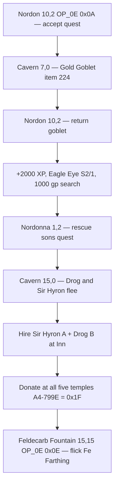

# Nordon / Nordonna Quest Chain (Middlegate)

Cross-refs: [`events/loc_60_quest_nordon_nordonna_corak.md`](events/loc_60_quest_nordon_nordonna_corak.md)
(string bank), [`events/loc_17_middlegate_cavern.md`](events/loc_17_middlegate_cavern.md)
(goblet + sons), [`33-skills-and-hirelings.md`](33-skills-and-hirelings.md) §5
(Sir Hyron **A** + Drog **B**), [`28-town-services.md`](28-town-services.md) §5.2.1
(Feldecarb Fountain — **separate** late step), [`45-event-graphics-opcodes.md`](45-event-graphics-opcodes.md)
(overlay engine), FAQ [`Might and Magic FAQ.txt`](Might%20and%20Magic%20FAQ.txt) ~3246–3276.

---

## 1. Three different things (do not conflate)

| Mechanism | Tile (FAQ x,y) | event.dat | Selector |
|-----------|----------------|-----------|----------|
| **Nordon goblet quest** | **`(10,2)/W`** | loc 00 **event 30** | **`OP_0E 0x0A`** (`goblet_quest` → `0xD634`) |
| **Nordonna hireling quest** | **`(1,2)`** | overlay only | quest engine + loc 60 str[16–20] |
| **Feldecarb farthing flick** | **`(15,15)`** | loc 00 **event 17** | **`OP_0E 0x0E`** (default-range → string bank str[23]) |
| **Arena Games** | **`(2,13)`** | loc 00 event 09 | **`OP_0E 0x08`** (tickets `0xD0`–`0xD3`) |

FAQ coordinates use **(x,y)**; event.dat trigger tables use **(y,x)** — e.g. FAQ `(10,2)` = event table `(2,10)`.

**Critical:** selector **`0x0A` is Nordon**, not Feldecarb. Feldecarb uses selector **`0x0E`**.

---

## 2. String bank (event.dat location 60)

Decoder location **60** is a **`string_bank`** only — no executable script segments.

| str | Speaker / use | Text (abbrev) |
|-----|---------------|---------------|
| `[08]` | Corak prologue | "The spirit of Corak proclaims…" |
| `[09]` | **Nordon intro** | "Will you do me a service (y/n)?" ← **`0x0A` handler** |
| `[10]` | Nordon (accept) | Retrieve magical golden goblet from goblins in cave below |
| `[11]` | Nordon (return goblet) | +2000 XP, **Eagle Eye** spell, search for 1000 gold |
| `[12]` | Nordon | Visit sister Nordonna |
| `[13]`–`[15]` | Nordon reminders / decline | |
| `[16]`–`[20]` | Nordonna quest / reward / hireling hint | |
| `[23]` | **Feldecarb Fountain** | Flick a farthing (y/n)? ← **`0x0E` @ (15,15)** |
| `[24]` | Fountain success | You find a fabulous castle key! |
| `[25]` | Fountain failure | Fool, you have no farthing to flick! |

Regenerate: `python tools/build_event_location_docs.py` (includes loc 60).

---

## 3. Quest flow (FAQ + event.dat)

### 3.1 Nordon — Gold Goblet

1. **`(10,2)/W`** — loc 00 **event 30**: `OP_0B` sign 0x14 (Nordon portrait) + **`OP_0E 0x0A`**. Intro str[9].
2. **Cavern loc 17 `(7,0)`** — event 03: `OP_19` gives **Gold Goblet** item **`0xE0` (224)**.
3. **`(10,2)` again** — return goblet to **Nordon** (str[11]), **not** Feldecarb Fountain.
4. Nordon sends you to Nordonna (str[12]).

**Port status:** intro str[9] wired in `EventTownServices.cpp` `case 0x0A`; full `0xD634` quest state deferred.

### 3.2 Nordonna — hirelings Sir Hyron (A) and Drog (B)

1. **`(1,2)`** — Nordonna (str[16]) only after Nordon's quest is complete; otherwise str[18].
2. **Rescue** — Cavern loc 17 **`(15,0)`** event 04: sons flee + roster **`$76`** (`or=0x0A`).
3. **Hire at Middlegate Inn** — str[20]; hirelings **A** (Sir Hyron) and **B** (Drog).

**Port status:** overlay at `(1,2)` and inn unlock **deferred**.

### 3.3 Feldecarb Fountain — farthing (late game)

**Only after** Nordonna's str[20] hint (and typically all temple donations — `A4-$799E == 0x1F`).

- **Tile:** Middlegate **`(15,15)`** — loc 00 **event 17**: **`OP_0E 0x0E`**
- **Prompt:** loc 60 str[23] (wired in `EventTownServices.cpp` `default:` when `sel == 0x0E`)
- **Item:** **Fe Farthing** (item **212** / `0xD4`); reward str[24] castle key
- **This is not** Nordon and **not** goblet turn-in

---

## 4. event.dat loc 00 summary

| Tile (x,y) | Event | Mechanism |
|------------|-------|-----------|
| `(10,2)` Nordon | 30 | `OP_0B` + **`OP_0E 0x0A`** |
| `(1,2)` Nordonna | — | Quest overlay + loc 60 strings |
| `(15,15)` Feldecarb | 17 | **`OP_0E 0x0E`** |
| `(2,13)` Arena | 09 | `OP_0E 0x08` |
| Cavern `(7,0)` goblet | loc **17** evt 03 | `OP_19` item `0xE0` |
| Cavern `(15,0)` sons | loc **17** evt 04 | rescue |

---

## 5. Remake / walker port status

| Step | C++ `game/` | Wiki `eventVm.js` |
|------|-------------|-------------------|
| Nordon `(10,2)` intro | **`case 0x0A`** str[9] | **`sel 0x0A`** stub dialogue |
| Goblet pickup `(7,0)` | `OP_19` | Same VM |
| Return goblet / rewards | **Deferred** (`0xD634`) | Stub only |
| Nordonna `(1,2)` | **Deferred** (overlay) | Overlay stub |
| Feldecarb `(15,15)` | **`sel 0x0E`** str[23] intro | **`sel 0x0E`** stub |
| Inn hirelings A+B | **Deferred** | **Not wired** |

**Bug fixed (2026-07):** `case 0x0A` had been wired to Feldecarb str[23], so Nordon's portrait showed the fountain farthing prompt — wrong handler for the selector.

---

*Last updated: 2026-07 — 0x0A = Nordon @ (10,2); 0x0E = Feldecarb @ (15,15) per FAQ + event.dat.*
