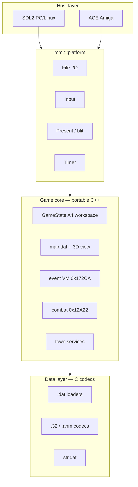

# MM2 — cross-platform remake

Faithful C++ reimplementation of *Might & Magic II* (Amiga), driven by the
68k disassembly and decoded `.dat` / asset formats in `EXTRACTED/`.

## Design principle

- **100% ASM/Amiga fidelity** — match original 68k behaviour exactly; no invented
  UX. See [Game remake (`game/`)](../CLAUDE.md#game-remake-game) in `CLAUDE.md`.
- **AGA port (planned)** — 6 bitplanes, extension palette, multi-monster combat art,
  future UI, and additive dungeons/content: [`EXTRACTED/docs/41-aga-port-plan.md`](../EXTRACTED/docs/41-aga-port-plan.md).

## Targets

| Platform | Backend | C/C++ runtime |
|----------|---------|---------------|
| Windows, Linux, macOS | **SDL2** | Host libc + libstdc++ |
| Amiga (68000+) | **ACE** ([AmigaPorts/ACE](https://github.com/AmigaPorts/ACE)) | **mini-std + custom `new`/`delete`/`operator[]`** — no libstdc++ |

Desktop builds use SDL2 directly (not ACE’s experimental SDL shim). Amiga builds
link ACE for blitter/copper/input/audio and route all dynamic allocation through
`mm2::runtime` (`memAlloc` / `memFree`).

## Layout

```
game/
  CMakeLists.txt
  include/mm2/          Shared headers (platform-neutral game API)
  src/
    main.cpp            Entry (desktop) or thin wrapper (Amiga + ACE generic main)
    Game.cpp            High-level setup / tick / draw
    TitleScreen.cpp     Title attract/menu (320×200), logo, peekers
    ui/                 Character UI backends (AmigaClassic / Stub)
    gfx/                320×200 compositor + Mm2Font8x8.inc
    platform/sdl/       SDL2 window, input, file I/O
    platform/amiga/     ACE viewport, chip/fast mem, OS file hooks
    runtime/            Allocators, freestanding buffers
EXTRACTED/decomp/       Pure-C codecs lifted from RE (shared with editor tools)
```

## Architecture



## Implementation phases

1. **Bootstrap** (current) — **320×200** compositor (`ScreenCompositor`), title screen
   (`intro.32` @ (3,0) + `introclips.32` pegasus/peekers + `nwcp.32` logo + `book.32`
   menu on black), roster viewer (`roster.dat`), 2× SDL present. Menu text uses
   **`Mm2Font8x8.inc`** (plain ASCII). Title animation spec:
   [`EXTRACTED/docs/39-title-screen-animation.md`](../EXTRACTED/docs/39-title-screen-animation.md).
   Character UI is pluggable — see
   [`39-character-ui-view-create.md`](../EXTRACTED/docs/39-character-ui-view-create.md).
2. **Data + state** — wire all `.dat` codecs; materialize `A4` workspace (`mm2_gamestate.h`).
3. **3D view** — port `0x2900` hood renderer (208×120 viewport, wall fields from map page 0).
4. **Main loop** — `0x1280` mode dispatch (overland, town, combat, menus).
5. **Events** — triplet scanner `0x175E2`, script VM, `OP_0E` town-service dispatch.
6. **Combat** — round loop, player bar, monster AI, rewards.
7. **Audio** — Paula tone path from `master.32` or MOD export fallback on desktop.
8. **Copy protection** — externalize globe/disk strings (already extracted to `EXTRACTED/embedded_strings.json`).

RE references: [`EXTRACTED/docs/README.md`](../EXTRACTED/docs/README.md),
`EXTRACTED/mm2.capstone.annotated.asm`, per-location events in `EXTRACTED/docs/events/`.

## Build (desktop / SDL2)

Requires CMake ≥ 3.16, C++17, network on first configure (SDL2 fetched via FetchContent).

```bash
cd game
cmake -S . -B build -G Ninja -DCMAKE_BUILD_TYPE=Release
cmake --build build
./build/mm2 ../          # pass MM2 data directory (contains map.dat, town.32, …)
./build/mm2 ../ --ui=stub   # text-only character UI fallback
```

### Character UI plugin

View Party (**P**) and Create (**C**) use a swappable layer (`game/include/mm2/ui/`):

| Backend | Select |
|---------|--------|
| **`AmigaClassic`** (default) | `--ui=classic`, `MM2_UI=classic`, or `-DMM2_UI=classic` |
| **`Stub`** (text overlay) | `--ui=stub`, `MM2_UI=stub`, or `-DMM2_UI=stub` |

Requires `book.32` in the data directory for the classic sheet backdrop.
See [`EXTRACTED/docs/39-character-ui-view-create.md`](../EXTRACTED/docs/39-character-ui-view-create.md).

Validate `.32` decode (C codec vs Python reference):

```bash
cmake --build build
python ../tools/test_image32_golden.py --data-dir ..
```

## Build (Amiga / ACE)

Same setup as [`../Amiga/LandsOfLore`](../Amiga/LandsOfLore): **VS Code “Amiga Debug”**
(BartmanAbyss `amiga-debug`) provides `m68k-amiga-elf-gcc`, `elf2hunk`, and sys-include.
The toolchain is auto-detected under `%USERPROFILE%/.vscode/extensions/bartmanabyss.amiga-debug-*`
(override with `-DAMIGA_VSCODE_BIN=…/bin/win32`).

```powershell
cd game
cmake --preset m68k-bartman-1.8.2
cmake --build build/m68k-bartman-1.8.2 --parallel
# -> build/m68k-bartman-1.8.2/mm2.exe (ELF2HUNK hunk executable)
```

Presets live in `CMakePresets.json`; toolchain files in `cmake/` (`mm2-m68k-bartman.cmake`,
`AmigaCMakeCrossToolchains/m68k-bartman.cmake`). ACE is fetched from `Vairn/ACE` branch **AGA**
(matching LoL). VS Code kit: `.vscode/cmake-kits.json` + `amiga.json`.

Amiga uses `-fno-exceptions -fno-rtti` and `CppStdCompat.h` instead of libstdc++.

**6bpp AGA screen** (LoL `screen.c` pattern, `TAG_VPORT_BPP` **6** not LoL’s 8):
`src/platform/amiga/mm2_amiga_display.c`, defines in `include/mm2/platform/amiga/Mm2AmigaConfig.h`.
`presentFrame()` refreshes copper; chunky RGBA→planar c2p is still TODO.

## Conventions

- **Endianness**: `.dat` multibyte fields are **little-endian on disk** (see root `CLAUDE.md`).
- **Graphics**: planar 5-bp `.32` / `.anm` image chunks — `mm2_image32_codec.c`.
- **Naming**: lifted routines keep `sub_<addr>_<purpose>` until fully understood.
- **No Blitz3D**: original 68k ASM is the source of truth for runtime behaviour.
