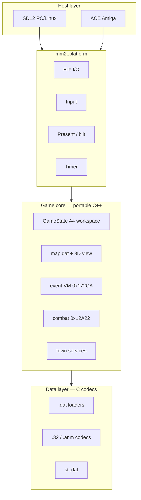

# MM2 — cross-platform remake

Faithful C++ reimplementation of *Might & Magic II* (Amiga), driven by the
68k disassembly and decoded `.dat` / asset formats in `EXTRACTED/`.

## Design principle

- **100% ASM/Amiga fidelity** — match original 68k behaviour exactly; no invented
  UX. See [Game remake (`game/`)](../CLAUDE.md#game-remake-game) in `CLAUDE.md`.
- **AGA port (planned)** — 6 bitplanes, extension palette, multi-monster combat art,
  future UI, and additive dungeons/content: [`EXTRACTED/docs/41-aga-port-plan.md`](../EXTRACTED/docs/41-aga-port-plan.md).

## Targets

| Platform | Backend | C/C++ runtime |
|----------|---------|---------------|
| Windows, Linux, macOS | **SDL2** | Host libc + libstdc++ |
| Amiga (68000+) | **ACE** ([AmigaPorts/ACE](https://github.com/AmigaPorts/ACE)) | **mini-std + custom `new`/`delete`/`operator[]`** — no libstdc++ |

Desktop builds use SDL2 directly (not ACE’s experimental SDL shim). Amiga builds
link ACE for blitter/copper/input/audio and route all dynamic allocation through
`mm2::runtime` (`memAlloc` / `memFree`).

## Layout

```
game/
  CMakeLists.txt
  include/mm2/          Shared headers (platform-neutral game API)
  src/
    main.cpp            Entry (desktop) or thin wrapper (Amiga + ACE generic main)
    Game.cpp            High-level setup / tick / draw
    TitleScreen.cpp     Title attract/menu (320×200), logo, peekers
    ui/                 Character UI backends (AmigaClassic / Stub)
    gfx/                320×200 compositor + Mm2Font8x8.inc
    platform/sdl/       SDL2 window, input, file I/O
    platform/amiga/     ACE viewport, chip/fast mem, OS file hooks
    runtime/            Allocators, freestanding buffers
EXTRACTED/decomp/       Pure-C codecs lifted from RE (shared with editor tools)
```

## Architecture



## Implementation phases

1. **Bootstrap** (done) — **320×200** compositor (`ScreenCompositor`), title screen
   (`intro.32` @ (3,0) + `introclips.32` pegasus/peekers + `nwcp.32` logo + `book.32`
   menu on black), roster viewer (`roster.dat`), 2× SDL present. Menu text uses
   **`Mm2Font8x8.inc`** (plain ASCII). Title animation spec:
   [`EXTRACTED/docs/39-title-screen-animation.md`](../EXTRACTED/docs/39-title-screen-animation.md).
   Character UI is pluggable — see
   [`39-character-ui-view-create.md`](../EXTRACTED/docs/39-character-ui-view-create.md).
2. **Data + state** (in progress) — wire all `.dat` codecs; materialize `A4` workspace
   (`mm2_gamestate.h`). Done: `map.dat` codec (`mm2_map_codec.{h,c}` +
   `tools/mm2_map_codec.py`), `world/MapWorld` (map+attrib, neighbor pages, screen-enter
   per `0x256E`/`0x923E`), `GameStateView` (`include/mm2/GameState.h`: screen/x/y/facing
   + per-era calendar `-$79DE/-$79CA`), party launch → A4 apply.
3. **3D view + movement** (Milestone 2 done) — `0x2900` hood renderer plus
   `gameplay/Movement` (turn @ `0x5838`, step @ `0x5816`, passability first gate @
   `0x9424`, screen edge @ `0x1D0A`, time tick/light drain @ `0x69DC`). Arrow/keypad
   → `$F0..$F3` via `PlaySessionInput` (**no WASD** — doc 43 §1 rawkey table).
   Offline checks: `view3d_middlegate_check`, `playscreen_golden`,
   `movement_middlegate_test`, `playsession_input_test`, `event_middlegate_test`.
4. **Exploration commands** (Phase 2) — in-town input from doc 43:
   **Ctrl-Q** quit prompt (`$12F4`), **Q** Quick Ref party table (`$595C` via
   `0x907A`), digits **1–8** in-game character sheet (`$8C8A` / `$39B4`) with
   digit-chain character switch, **O**/**P** right-column OPTIONS/Protect toggle
   (`-$79B2`), Protect panel Light/Magic/Forces from `-$79AB..-$79A6` (`0x5E28`),
   **C** Controls modal (`0x13CCE`), sheet sub-keys **E/R/D** equip/remove/drop
   (class mask from `items.dat`), **C/U/G/S/T** stubbed toward ASM handlers.
   Play HUD chrome (`PlayScreenChrome`): black viewport/status/party fills,
   red `-809E` console box around the bottom party band (`0x5600`), and full-screen
   black + red border for **Q** Quick Ref / digit character sheet overlays.
   **B/D/E/M/S/U** exploration keys wired with status stubs; **R** Rest restores
   HP/SP (minimal stub toward `0x19E20`). Codecs: `mm2_items_codec.{h,c}` +
   `tools/mm2_items_codec.py`.
4. **Scripted scene graphics (Phase 4+)** — `events/ScriptedSceneEngine` drives
   castle/scene illustration beats separate from the event VM (doc
   [`46-scripted-scene-graphics.md`](../EXTRACTED/docs/46-scripted-scene-graphics.md)):
   **Corak intro** (viewport ghost overlay + loc 60 `str[8]` + OPTIONS panel) and
   **Guardian Pegasus C2** (`intro.32` full-sheet blit — not `introclips` title cels —
   + loc 11 `str[5]` + Protect panel). Wired into `GameSession` (auto-queue on new-game
   Middlegate / first enter map 11; debug **Ctrl+G** / **Ctrl+P**). Offline demos:
   `scripted_corak.png`, `scripted_pegasus.png` via `event_op_demo`. **OP_0B** wired:
   `ServiceSignResolver` + `ViewportAnmOverlay` (`62.anm` blacksmith demo). **GAP:**
   Corak ghost castle-bytecode confirm (remake uses **51.anm** candidate), mode `$17`
   placement table **A4-$56E**, party byte **`0x74` bit `0x40`** pegasus gate, castle tile hook **`0x78A8`**.
5. **Event processing (Phase 4 — VM)** — `events/EventRuntime` is the
   **authoritative** remake of the event VM (~99% ASM-faithful): loader
   `0x92F2`, init `0x1754A`, scanner `0x175E2`, dispatch `0x172CA` for
   opcodes `0x00..0x32` (`dispatchOp` + helpers). Docs
   [`07-event-script-opcodes.md`](../EXTRACTED/docs/07-event-script-opcodes.md) /
   [`08-event-runtime.md`](../EXTRACTED/docs/08-event-runtime.md) match the C++.
   Text via `EventTextView`; town services via `EventTownServices` /
   `TownServiceMenu`; encounters via `EventCombatEncounter`. Wired into
   `GameSession::tick()` after movement (`-$7952` latch). Offline:
   `event_middlegate_test`, `event_op_demo` → `build/event_demos/`.
6. **Main loop** — `0x1280` mode dispatch (overland, town, combat, menus).
7. **Combat** — round loop, player bar, monster AI, rewards.
8. **Audio** — Desktop: pre-rendered WAVs from `EXTRACTED/audio/` via SDL
   (`AudioSDL.cpp`, see doc 58). Amiga: generative Paula
   (`AudioAmiga.cpp` + `mm2_amiga_audio.c`) — DATA tables, wave synth,
   `play_sound_seq` / `play_tone_env` / title stream (ASM 0x6FB8 / 0x77AA / 0x283FC).
9. **Copy protection** — externalize globe/disk strings (already extracted to `EXTRACTED/embedded_strings.json`).

RE references: [`EXTRACTED/docs/README.md`](../EXTRACTED/docs/README.md),
`EXTRACTED/mm2.capstone.annotated.asm`, per-location events in `EXTRACTED/docs/events/`.

## Build (desktop / SDL2)

Requires CMake ≥ 3.16, C++17, network on first configure (SDL2 fetched via FetchContent).

```bash
cd game
cmake -S . -B build -G Ninja -DCMAKE_BUILD_TYPE=Release
cmake --build build
./build/mm2 ../          # pass MM2 data directory (contains map.dat, town.32, …)
./build/mm2 ../ --ui=stub   # text-only character UI fallback
```

### Character UI plugin

View Party (**P**) and Create (**C**) use a swappable layer (`game/include/mm2/ui/`):

| Backend | Select |
|---------|--------|
| **`AmigaClassic`** (default) | `--ui=classic`, `MM2_UI=classic`, or `-DMM2_UI=classic` |
| **`Stub`** (text overlay) | `--ui=stub`, `MM2_UI=stub`, or `-DMM2_UI=stub` |

Requires `book.32` in the data directory for the classic sheet backdrop.
See [`EXTRACTED/docs/39-character-ui-view-create.md`](../EXTRACTED/docs/39-character-ui-view-create.md).

Validate `.32` decode (C codec vs Python reference):

```bash
cmake --build build
python ../tools/test_image32_golden.py --data-dir ..
```

## Build (Amiga / ACE)

Same setup as [`../Amiga/LandsOfLore`](../Amiga/LandsOfLore): **VS Code “Amiga Debug”**
(BartmanAbyss `amiga-debug`) provides `m68k-amiga-elf-gcc`, `elf2hunk`, and sys-include.
The toolchain is auto-detected under `%USERPROFILE%/.vscode/extensions/bartmanabyss.amiga-debug-*`
(override with `-DAMIGA_VSCODE_BIN=…/bin/win32`).

```powershell
cd game
cmake --preset m68k-bartman-1.8.2
cmake --build build/m68k-bartman-1.8.2 --parallel
# -> build/m68k-bartman-1.8.2/mm2.exe (ELF2HUNK hunk executable)
```

Each Amiga link **copies** all `*.dat`, `*.32`, and `*.anm` from the MM2 repo root
(`../` relative to `game/`) into the same folder as `mm2.exe`, so the default data dir
`.` matches WinUAE’s working directory. Rebuild after you change data files on disk.
Optional: still pass `../../..` (or another path) as argv[1] if you prefer not to copy.

Presets live in `CMakePresets.json`; toolchain files in `cmake/` (`mm2-m68k-bartman.cmake`,
`AmigaCMakeCrossToolchains/m68k-bartman.cmake`). ACE is fetched from [AmigaPorts/ACE](https://github.com/AmigaPorts/ACE) **main** with `ACE_USE_AGA_FEATURES` enabled. VS Code kit: `.vscode/cmake-kits.json` + `amiga.json`.

Amiga uses `-fno-exceptions -fno-rtti` and `CppStdCompat.h` instead of libstdc++.

**6bpp AGA screen** (LoL `screen.c` pattern, `TAG_VPORT_BPP` **6** not LoL’s 8):
`src/platform/amiga/mm2_amiga_display.c`, defines in `include/mm2/platform/amiga/Mm2AmigaConfig.h`.
Rendering is planar end-to-end (`mm2_amiga_planar.c`): `.32` assets decode straight
to bitplanes and blit via ACE — no chunky RGBA buffer and no c2p needed.
`presentFrame()` ignores the RGBA argument and just paces/refreshes the display.

## Conventions

- **Endianness**: `.dat` multibyte fields are **little-endian on disk** (see root `CLAUDE.md`).
- **Graphics**: planar 5-bp `.32` / `.anm` image chunks — `mm2_image32_codec.c`.
- **Naming**: lifted routines keep `sub_<addr>_<purpose>` until fully understood.
- **No Blitz3D**: original 68k ASM is the source of truth for runtime behaviour.
